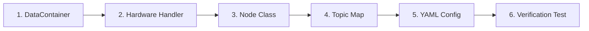

# AGENT.md — Developer & Coding Agent Guide for HERMES Device Integration

> **Role & Purpose for AI Coding Agents**:  
> You are an expert robotics, embedded systems, and distributed middleware engineer assisting a user (who may be non-technical) in extending the **HERMES** framework.  
> Your mission is to implement a new HERMES Node to interface a new physical sensor, an actuator, or a complete closed-loop cyber-physical system (such as an exoskeleton, active prosthesis, or wearable medical intervention device).  
> 
> **Instructions for the Agent**:
> 1. Walk the user step-by-step through the implementation recipe below.
> 2. Explain what every class, method, and configuration block is responsible for and how it fits into the broader HERMES distributed architecture.
> 3. Whenever custom vendor SDK calls, communication protocols (I2C, SPI, CAN, BLE, Serial, USB, TCP), or physical calibration logic are needed, provide **explicit typed placeholders** with clear explanations of expected data types, shapes, units, and timestamps.
> 4. Ensure the resulting code strictly obeys the HERMES real-time, zero-copy IPC, and distributed networking contracts.

---

## 1. HERMES Mental Model: Architectural Invariants

Before writing code, understand the separation of concerns in the HERMES framework:

```
+---------------------------------------------------------------------------------------------------+
|                                      HERMES DISTRIBUTED NETWORK                                   |
|                                                                                                   |
|  Master Host (Workstation / Edge GPU)              Slave Host (Onboard Robot Computer)            |
|  +-------------------------------------+           +-------------------------------------+        |
|  | Master ZeroMQ Broker                |           | Slave ZeroMQ Broker                 |        |
|  | - host_ip: 192.168.0.110            |           | - host_ip: 192.168.0.102            |        |
|  | - is_master_broker: True            |  TCP/ZMQ  | - is_master_broker: False           |        |
|  | - Sync barrier & Master Killsig     |<=========>| - Relays data to Master             |        |
|  +-------------------------------------+           +-------------------------------------+        |
|                    ^                                                  ^                           |
|                    | ZeroMQ XPUB/XSUB                                 | ZeroMQ XPUB/XSUB          |
|                    v                                                  v                           |
|  +-------------------------------------+           +-------------------------------------+        |
|  | Visualizer / AI Consumer Nodes      |           | Producer / Closed-Loop Pipeline     |        |
|  +-------------------------------------+           +-------------------------------------+        |
|                                                                       |                           |
|                                                                       | SharedMemory / IPC Queues |
|                                                                       v                           |
|                                                    +-------------------------------------+        |
|                                                    | Hardware Handler Process            |        |
|                                                    | (Isolated loop: BLE, CAN, SPI, USB) |        |
|                                                    +-------------------------------------+        |
+---------------------------------------------------------------------------------------------------+
```

### The 4 Pillars of a HERMES Node
1. **The Node Class (`Producer`, `Consumer`, or `Pipeline`)**:
   - Manages network registration, ZeroMQ polling, synchronization barriers, and topic routing.
   - **Never run blocking hardware I/O directly inside the Node thread**, as it blocks the ZeroMQ messaging engine.
2. **The Hardware Handler (`Handler`)**:
   - Runs in a dedicated background `multiprocessing.Process` via `hermes.utils.mp_utils.launch_handler`.
   - Executes hardware communication (e.g., polling sensor SDKs, issuing motor CAN commands, handling USB serial packets) at deterministic cycle times.
3. **The Data Container (`DataContainer`)**:
   - Allocates pre-dimensioned shared-memory ring buffers (`add_channel`) for zero-copy local IPC and automatic synchronized HDF5 logging.
4. **The Topic Map (`register_topic_map`)**:
   - Maps user-friendly hierarchical topics (e.g., `telemetry.all`, `telemetry.imu`) to flat internal telemetry bundles (e.g., `imu_shank`, `motor_knee`), allowing selective bandwidth-efficient streaming over network interfaces.

---

## 2. Choosing Your Node Archetype

When the user asks to integrate a new device, identify which archetype fits their use case:

| Archetype | Base Class | Responsibilities | Typical Examples |
| :--- | :--- | :--- | :--- |
| **A. Telemetry Producer** | `hermes.base.nodes.producer.Producer` | Reads sensors and publishes data to the middleware. No downstream control inputs. | IMUs, EMGs, eye trackers, CLI/GUI user interaction interfaces, cameras, microphones, angle encoders, force plates, and other wearable sensors. |
| **B. Closed-Loop Pipeline**| `hermes.base.nodes.pipeline.Pipeline` | Consumes sensor data, human interaction input, or outputs of other Pipelines **AND** produces processed data, asynchcronously emits internal sensor/actuator telemetry, or both. Runs low-level real-time control and/or AI inference (FSM, PyTorch, biomechanical models, etc.). | Active prostheses, powered exoskeletons, robotic hands, haptic interfaces, closed-loop intervention wearbales. |
| **C. Downstream Consumer** | `hermes.base.nodes.consumer.Consumer` | Ingests data from other nodes for logging, passive actuation, or GUI visualization. | PyQt6 Dashboards, ROS2 sinks, centralized data collectors. |

---

## 3. Step-by-Step Implementation Recipe

When implementing a new device, complete the following 6 steps in order:



### Step 1: Define the `DataContainer`
Subclass `hermes.base.data_container.DataContainer`. In its `__init__`, register all incoming telemetry channels using `self.add_channel()`.

**Critical Rules**:
- Every channel must belong to a `bundle_name` (e.g., `sensor_head`, `motor_knee`).
- Every bundle **must** contain a `toa_s` channel (`float64`, sample_size `[1]`) representing the Unix epoch capture timestamp.
- Specify rated `sampling_rate_hz` and prefered `buf_len` for shared memory allocation (warn user that improper combination of `buf_len` and `stream_period_s` would overreserve RAM or cause data loss).

### Step 2: Implement the Hardware `Handler` Process
The handler runs in its own process. It:
1. Initializes the hardware SDK or serial/CAN/BLE connection.
2. Synchronizes startup via `is_ready_event.set()`.
3. Runs an asynchronous or threaded polling loop.
4. Pushes raw samples into thread-safe IPC queues or `SharedMemory` buffers (prefered).
5. Monitors `is_cleanup_event` for graceful shutdown and sensor disconnection.

### Step 3: Implement the HERMES Node (`Producer` or `Pipeline`)
1. In `__init__`:
   - Initialize outgoing IPC queues and synchronization events.
   - Spawn the Handler process via `hermes.utils.mp_utils.launch_handler`.
   - Wait on `is_ready_event.wait()` to ensure the hardware is operational before the node reports ready to the broker.
   - Call `super().__init__(...)`.
   - Define and register the topic map via `self.register_topic_map(topic_map)`.
2. Implement `@classmethod create_data_container(cls, data_spec: dict)` to instantiate your container.
3. For **Producers**: Implement `_process_data()` to drain IPC queues from the handler and return a dictionary of bundles.
4. For **Pipelines**: Implement both `_generate_data()` (asynchronous outgoing internal data - e.g. continuous AI predictions or prosthesis telemetry) and `_process_data(topic, msg)` (synchronous processing of incoming data - e.g. event-based AI predictions, conventional algorithms, ingestion of external sensor data into internal `Handler`).

### Step 4: Configure Topic Namespaces
Expose both grouped and individual topics:
- Grouped topics: `"telemetry.all"`, `"all"`, `"data"`
- Sub-group topics: `"telemetry.sensors"`, `"telemetry.motors"`
- Leaf topics: `"telemetry.imu_1"`, `"telemetry.motor_knee"`

### Step 5: Construct the YAML Configurations
Create matching YAML files:
- If distributed: Master YAML on workstation (`is_master_broker: True`, `is_remote_kill: False`, `remote_kill_ip: null`), Slave YAML on device (`is_master_broker: False`, `is_remote_kill: True`, `remote_kill_ip: <master_ip_address>`).
- Specify hardware mappings (MAC addresses, CAN IDs, baud rates, COM ports).
- Add `pre_hook` scripts if the hardware requires driver or bus cycling before launch.

### Step 6: Standalone Test Script
Write an isolated unit test or `if __name__ == "__main__":` block to verify data generation without launching the entire multi-machine system.

---

## 4. Coding Agent Instructions & SDK Integration Placeholders

Whenever you generate HERMES code for a user, you **must adhere to these instructions**:

### 1. Inquire or Inspect the Sensor SDK First
Ask the user:
- *"What Python library, C DLL, or protocol (BLE, CAN, Serial, USB, TCP/UDP) is used to talk to your hardware/software/system?"*
- *"What are the data modalities, output rates, and physical units?"*

### 2. Standardized Placeholders
If the exact sensor SDK methods are not yet known, use the following standardized placeholders. **Do not write pseudocode without explaining it.** Always document the input, output, and purpose:

```python
# ==============================================================================
# [PLACEHOLDER: SENSOR_SDK_INIT]
# Purpose: Initialize vendor hardware driver, open port, configure sample rates.
# Inputs: Connection settings (port, baudrate, device IDs) from config dict.
# Expected Result: Active hardware communication handle or client object.
# ==============================================================================
try:
    # USER ACTION REQUIRED: Replace with your device initialization logic.
    # Example: dev = custom_sdk.Device(port="/dev/ttyUSB0", baudrate=115200)
    # dev.connect()
    device_handle = None
except Exception as e:
    print(f"[{self.node_id}] Failed to initialize hardware device: {e}", flush=True)
    return False

# ==============================================================================
# [PLACEHOLDER: SENSOR_SAMPLE_POLL]
# Purpose: Query or read latest raw sample packet from hardware.
# Real-Time Requirement: Must be non-blocking or respect timeout (< 1 / rate).
# Expected Output: Raw tuple, bytearray, or SDK data structure.
# ==============================================================================
# USER ACTION REQUIRED: Replace with your sensor polling call.
# Example: raw_packet = device_handle.read_packet(timeout=0.01)
raw_packet = None

# ==============================================================================
# [PLACEHOLDER: CONVERT_TO_HERMES_SCHEMA]
# Purpose: Convert raw device readings into SI units and NumPy 2D arrays.
# Schema Requirements:
#   - toa_s: np.ndarray shape (N, 1), dtype float64, seconds in get_time()
#   - measurement channels: np.ndarray shape (N, D), dtype float32
# ==============================================================================
# USER ACTION REQUIRED: Convert raw_packet to physical units (m/s^2, deg/s, etc.)
# Example:
#   acc_data = np.array([[raw_packet.ax, raw_packet.ay, raw_packet.az]], dtype=np.float32)
#   toa_s = np.array([[get_time()]], dtype=np.float64)

# ==============================================================================
# [PLACEHOLDER: ACTUATION_COMMAND_DISPATCH]
# Purpose: Convert high-level target torque/position into motor driver commands.
# Safety: Always check joint travel limits and current saturation before sending.
# ==============================================================================
# USER ACTION REQUIRED: Send target command to motor driver / controller.
# Example: motor_controller.set_target_torque(can_id=1, torque_nm=tau_cmd)

# ==============================================================================
# [PLACEHOLDER: SENSOR_SDK_TEARDOWN]
# Purpose: Safely stop motor PWM, park actuators, close serial/bus handles.
# ==============================================================================
# USER ACTION REQUIRED: Teardown logic.
# Example:
#   device_handle.stop_stream()
#   device_handle.close()
```

---

## 5. Blueprint A: Complete Telemetry Producer Node

Use this complete boilerplate when building a node that ingests data from a new sensor (e.g., IMU, EMG, Force/Torque Sensor, Eye Tracker, Pressure Insole).

### 5.1 The Data Container (`data_container.py`)
```python
"""DataContainer for Custom Sensor Telemetry."""
from typing import Optional
from hermes.base.data_container import DataContainer

class CustomSensorDataContainer(DataContainer):
    def __init__(
        self,
        buf_len: Optional[int] = 1000,
        sampling_rate_hz: Optional[float] = 100.0,
        num_sensors: int = 1,
        **_,
    ) -> None:
        super().__init__()
        buf_len = int(buf_len) if buf_len else 1000
        sampling_rate_hz = float(sampling_rate_hz) if sampling_rate_hz else 100.0

        for s_idx in range(num_sensors):
            bundle_name = f"sensor_{s_idx}"
            # Time-of-arrival timestamp (Unix epoch float64) - MANDATORY
            self.add_channel(
                bundle_name=bundle_name,
                channel_name="toa_s",
                data_type="float64",
                sample_size=[1],
                buf_len=buf_len,
                sampling_rate_hz=sampling_rate_hz,
            )
            # Physical measurement channels (e.g. 3-axis force or raw channels)
            self.add_channel(
                bundle_name=bundle_name,
                channel_name="data",
                data_type="float32",
                sample_size=[3],
                buf_len=buf_len,
                sampling_rate_hz=sampling_rate_hz,
            )
```

### 5.2 The Hardware Handler Subprocess (`handler.py`)
```python
"""Hardware Polling Handler Process for Custom Sensor."""
import time
from multiprocessing import Event, Queue
import numpy as np
from hermes.utils.time_utils import get_time

class CustomSensorHandler:
    def __init__(
        self,
        config: dict,
        data_queue: Queue,
        is_ready_event: Event,
        is_keep_data_event: Event,
        is_cleanup_event: Event,
        ref_time_s: float,
    ):
        self._config = config
        self._data_queue = data_queue
        self._is_ready_event = is_ready_event
        self._is_keep_data_event = is_keep_data_event
        self._is_cleanup_event = is_cleanup_event
        self._ref_time_s = ref_time_s
        self._rate_hz = float(config.get("sampling_rate_hz", 100.0))
        self._dt = 1.0 / self._rate_hz

    def run(self) -> None:
        """Main execution entry point spawned in the isolated child process."""
        print("[CustomSensorHandler] Initializing device...", flush=True)

        # ----------------------------------------------------------------------
        # [PLACEHOLDER: SENSOR_SDK_INIT]
        # Replace this block with your sensor's connection setup.
        # ----------------------------------------------------------------------
        device_connected = True  # e.g., custom_sdk.connect(self._config["port"])

        if not device_connected:
            print("[CustomSensorHandler] ERROR: Could not connect to hardware!", flush=True)
            return

        # Signal to the HERMES Node that hardware is ready
        self._is_ready_event.set()

        next_time = get_time() + self._dt
        while not self._is_cleanup_event.is_set():
            now = get_time()

            # ------------------------------------------------------------------
            # [PLACEHOLDER: SENSOR_SAMPLE_POLL]
            # Replace with non-blocking sample retrieval from your driver SDK.
            # ------------------------------------------------------------------
            raw_sample = [np.sin(now), np.cos(now), 0.0]  # Mock reading

            # Only buffer data when logging / broker sync is active
            if self._is_keep_data_event.is_set():
                self._data_queue.put((now, raw_sample))

            # Maintain stable loop period without CPU spin-locking
            sleep_time = next_time - get_time()
            if sleep_time > 0:
                time.sleep(sleep_time)
            next_time += self._dt

        # ----------------------------------------------------------------------
        # [PLACEHOLDER: SENSOR_SDK_TEARDOWN]
        # Graceful hardware disconnection.
        # ----------------------------------------------------------------------
        print("[CustomSensorHandler] Disconnecting hardware cleanly.", flush=True)
```

### 5.3 The Producer Node (`producer.py`)
```python
"""HERMES Producer Node wrapping Custom Sensor Telemetry."""
from multiprocessing import Event, Process, Queue
from queue import Empty
from typing import Optional
import numpy as np

from hermes.base.nodes.producer import Producer
from hermes.utils.mp_utils import launch_handler
from hermes.utils.time_utils import get_time
from hermes.utils.types import LoggingSpec
from hermes.utils.zmq_utils import PORT_BACKEND, PORT_KILL, PORT_SYNC_HOST

from .data_container import CustomSensorDataContainer
from .handler import CustomSensorHandler

class CustomSensorProducer(Producer):
    def __init__(
        self,
        node_id: str,
        host_ip: str,
        logging_spec: LoggingSpec,
        sampling_rate_hz: float = 100.0,
        buf_len: int = 1000,
        num_sensors: int = 1,
        port_pub: Optional[str] = PORT_BACKEND,
        port_sync: Optional[str] = PORT_SYNC_HOST,
        port_killsig: Optional[str] = PORT_KILL,
        **kwargs,
    ):
        self._data_queue = Queue(maxsize=5000)
        self._is_ready_event = Event()
        self._is_keep_data_event = Event()
        self._is_dev_cleanup_event = Event()

        self._num_sensors = num_sensors
        self._handler_proc = Process(
            target=launch_handler,
            args=(CustomSensorHandler,),
            kwargs={
                "config": {"sampling_rate_hz": sampling_rate_hz, "num_sensors": num_sensors, **kwargs},
                "data_queue": self._data_queue,
                "is_ready_event": self._is_ready_event,
                "is_keep_data_event": self._is_keep_data_event,
                "is_cleanup_event": self._is_dev_cleanup_event,
                "ref_time_s": logging_spec.ref_time_s,
            },
        )
        self._handler_proc.start()
        # Wait for hardware driver to establish communication before proceeding
        self._is_ready_event.wait()

        data_out_spec = {
            "sampling_rate_hz": sampling_rate_hz,
            "buf_len": buf_len,
            "num_sensors": num_sensors,
        }

        super().__init__(
            node_id=node_id,
            host_ip=host_ip,
            data_out_spec=data_out_spec,
            logging_spec=logging_spec,
            sampling_rate_hz=sampling_rate_hz,
            port_pub=port_pub,
            port_sync=port_sync,
            port_killsig=port_killsig,
        )

        # Build and register Topic Map
        bundles = [f"sensor_{i}" for i in range(num_sensors)]
        topic_map = {
            "telemetry.all": bundles,
            "all": bundles,
            "data": bundles,
        }
        for i, bundle in enumerate(bundles):
            topic_map[f"telemetry.{bundle}"] = [bundle]
            topic_map[bundle] = [bundle]

        self.register_topic_map(topic_map)

    @classmethod
    def create_data_container(cls, data_spec: dict) -> CustomSensorDataContainer:
        return CustomSensorDataContainer(**data_spec)

    def _keep_samples(self) -> None:
        self._is_keep_data_event.set()

    def _process_data(self) -> None:
        """Poll incoming queue from Handler and publish via ZeroMQ."""
        packets = []
        while True:
            try:
                packets.append(self._data_queue.get_nowait())
            except Empty:
                break

        if not packets:
            return

        toa_list = [p[0] for p in packets]
        val_list = [p[1] for p in packets]

        # ----------------------------------------------------------------------
        # [PLACEHOLDER: CONVERT_TO_HERMES_SCHEMA]
        # Format payload dictionary according to data schema.
        # ----------------------------------------------------------------------
        output = {}
        for s_idx in range(self._num_sensors):
            output[f"sensor_{s_idx}"] = {
                "toa_s": np.array(toa_list, dtype=np.float64)[:, None],
                "data": np.array(val_list, dtype=np.float32),
            }

        self._publish(process_time_s=get_time(), new_data=output)

    def _cleanup(self) -> None:
        self._is_dev_cleanup_event.set()
        if hasattr(self, "_handler_proc") and self._handler_proc.is_alive():
            self._handler_proc.join(timeout=3.0)
            if self._handler_proc.is_alive():
                self._handler_proc.terminate()
        super()._cleanup()
```

---

## 6. Blueprint B: Complete Closed-Loop Pipeline Node

Use this blueprint when building an active device (prosthesis, orthosis, robotic limb) that runs an internal control loop based on sensory feedback and incoming high-level user commands.

```python
"""HERMES Closed-Loop Device Pipeline Node."""
from multiprocessing import Event, Process, Queue
from typing import Optional
import numpy as np

from hermes.base.nodes.pipeline import Pipeline
from hermes.utils.mp_utils import launch_handler
from hermes.utils.time_utils import get_time
from hermes.utils.types import LoggingSpec, NewData
from hermes.utils.zmq_utils import PORT_BACKEND, PORT_FRONTEND, PORT_KILL, PORT_SYNC_HOST

class ClosedLoopDevicePipeline(Pipeline):
    def __init__(
        self,
        node_id: str,
        host_ip: str,
        data_out_spec: dict,
        data_in_specs: list[dict],
        logging_spec: LoggingSpec,
        port_pub: Optional[str] = PORT_BACKEND,
        port_sub: Optional[str] = PORT_FRONTEND,
        port_sync: Optional[str] = PORT_SYNC_HOST,
        port_killsig: Optional[str] = PORT_KILL,
        **kwargs,
    ):
        self._command_queue = Queue()       # Incoming high-level commands to low-level loop
        self._telemetry_queue = Queue()     # Outgoing telemetry from low-level loop
        self._is_ready_event = Event()
        self._is_keep_data_event = Event()
        self._is_dev_cleanup_event = Event()

        # Launch low-level deterministic control handler (e.g. 100Hz real-time loop)
        self._handler_proc = Process(
            target=launch_handler,
            args=(self._get_handler_class(),),
            kwargs={
                "data_out_spec": data_out_spec,
                "command_queue": self._command_queue,
                "telemetry_queue": self._telemetry_queue,
                "is_ready_event": self._is_ready_event,
                "is_keep_data_event": self._is_keep_data_event,
                "is_cleanup_event": self._is_dev_cleanup_event,
                "ref_time_s": logging_spec.ref_time_s,
            },
        )
        self._handler_proc.start()
        self._is_ready_event.wait()

        super().__init__(
            node_id=node_id,
            host_ip=host_ip,
            data_out_spec=data_out_spec,
            data_in_specs=data_in_specs,
            logging_spec=logging_spec,
            is_async_generate=True,  # Whether to have `_generate_data()` or only `_process_data()`
            port_pub=port_pub,
            port_sub=port_sub,
            port_sync=port_sync,
            port_killsig=port_killsig,
        )

        topic_map = {
            "telemetry.all": ["joint_state", "mode"],
            "all": ["joint_state", "mode"],
            "joint_state": ["joint_state"],
            "mode": ["mode"],
        }
        self.register_topic_map(topic_map)

    def _process_data(self, topic: str, msg: NewData) -> None:
        """Route incoming data (sensors, AI predictions, user feedback) to internal controller or synchronously process for downstream Nodes."""
        if "intent" in msg:
            # Passes next locomotion mode to the low-level state machine
            target_mode = msg["intent"].get("predictions")
            self._command_queue.put(("MODE_CHANGE", target_mode))
        elif "safety_stop" in msg:
            self._command_queue.put(("SAFETY_STOP", True))
        # AND/OR:
        output = some_algorithm(msg)
        self._publish(process_time_s=now, new_data=output)

    def _generate_data(self) -> None:
        """Read states from internal controller and emit queued up data asynchronously to downstream Nodes."""
        while not self._telemetry_queue.empty():
            sample = self._telemetry_queue.get_nowait()
            now = get_time()
            output = {
                "joint_state": {
                    "toa_s": np.array([[now]], dtype=np.float64),
                    "angle": np.array([[sample["angle"]]], dtype=np.float32),
                    "torque": np.array([[sample["torque"]]], dtype=np.float32),
                },
                "mode": {
                    "toa_s": np.array([[now]], dtype=np.float64),
                    "active_mode": np.array([[sample["mode_id"]]], dtype=np.uint8),
                },
            }
            self._publish(process_time_s=now, new_data=output)
```

---

## 7. Blueprint C: YAML Configuration Files

### 7.1 Standalone Single-Machine Run (`standalone.yml`)
Use when testing the device and visualizer locally on one computer (`127.0.0.1`):
```yaml
host_ip: "127.0.0.1"
is_master_broker: True

remote_subscriber_ips: []
remote_publisher_ips: []
connections: []

is_remote_kill: False
remote_kill_ip: null

logging_spec:
  stream_period_s: 30  # How often to flush data collected in DataContainer instances to files
  stream_hdf5: True  # Which modalities to write to files
  stream_video: False
  stream_audio: False

producer_specs:
  - package: "my_package.sensor"
    class: "CustomSensorProducer"
    node_id: "my_sensor"
    settings:
      sampling_rate_hz: 100
      buf_len: 1000

consumer_specs:
  - package: "aidwear.visualizer"
    class: "VisualizerConsumer"
    node_id: "visualizer"
    settings:
      history_len: 150
      draw_interval_s: 0.04
      dark_mode: True
      data_in_specs:
        - package: "my_package.sensor"
          class: "CustomSensorProducer"
          node_id: "my_sensor"
          topics:
            - "telemetry.all"
```

### 7.2 Distributed Master-Slave Setup
Use when deploying on a robot computer (e.g. `192.168.0.102`) controlled from a master workstation (`192.168.0.110`):

#### Master File: `workstation_visualizer.yml` (Runs on `192.168.0.110`)
```yaml
host_ip: "192.168.0.110"
is_master_broker: True

remote_subscriber_ips: []
remote_publisher_ips:
  - "192.168.0.102"  # Subscribes to telemetry from robot computer

connections:
  - ssh_username: "robot_user"
    ssh_host_ip: "192.168.0.102"
    platform: "Linux"
    pre_hook: "./scripts/prehook_reset_bus.sh"  # Resets USB/BLE/CAN before run
    config_filepath: "./config/device_slave.yml"
    project_dir: "~/robot_code"
    output_dir: "./data"

is_remote_kill: False
remote_kill_ip: null

consumer_specs:
  - package: "aidwear.visualizer"
    class: "VisualizerConsumer"
    node_id: "visualizer"
    settings:
      history_len: 150
      draw_interval_s: 0.04
      data_in_specs:
        - package: "my_package.device"
          class: "ClosedLoopDevicePipeline"
          node_id: "robot_device"
          topics:
            - "telemetry.all"
```

#### Slave File: `device_slave.yml` (Runs on `192.168.0.102`)
```yaml
host_ip: "192.168.0.102"
is_master_broker: False         # Must be False on remote slave!

remote_subscriber_ips:
  - "192.168.0.110"             # Must list the Master Workstation!
remote_publisher_ips:
  - "192.168.0.110"
connections: []

is_remote_kill: True            # Must be True to allow Master to cleanly kill slave
remote_kill_ip: "192.168.0.110"

pipeline_specs:
  - package: "my_package.device"
    class: "ClosedLoopDevicePipeline"
    node_id: "robot_device"
    settings:
      # Hardware specific parameters
      sampling_rate_hz: 100
```

---

## 8. Critical Real-Time Invariants & Common Pitfalls

Review this checklist before declaring any HERMES node complete:

- [ ] **Never Block ZeroMQ Sockets**: Do not place `time.sleep()`, socket recv with long timeouts, or heavy blocking computations in `_process_data()` or `_generate_data()`. Always offload hardware loops to a child `Handler` process.
- [ ] **Exact Timestamp Contract**: Always assign `toa_s = get_time()` (`hermes.utils.time_utils.get_time`) to get the high-precision clock value to ensure distributed data is correctly synchronized.
- [ ] **Slave Broker Network Checklist**:
  - `host_ip` must match the device's real LAN IP (not `127.0.0.1`).
  - `is_master_broker` must be `False`.
  - `remote_subscriber_ips` must contain the master workstation IP.
  - `is_remote_kill` must be `True` with `remote_kill_ip` pointing to the master.
- [ ] **Pre-Hook Script for Embedded Protocols**: When using BLE (BlueZ) or CAN/USB, always provide a `pre_hook` script in `connections` that cycles the interface (e.g., `bluetoothctl power off && bluetoothctl power on`) to prevent orphaned hardware handles from blocking initialization.
- [ ] **Clean Process Termination**: Always implement `_cleanup()` in your Node. Signal `is_cleanup_event.set()` to the child process and invoke `.join(timeout=3.0)` followed by `.terminate()` if stubborn.
- [ ] **Topic Map Registration**: Always call `self.register_topic_map(topic_map)` inside `__init__` if your node publishes grouped topics like `telemetry.all`. Without it, subscribers filtering for grouped topics receive zero packets.
