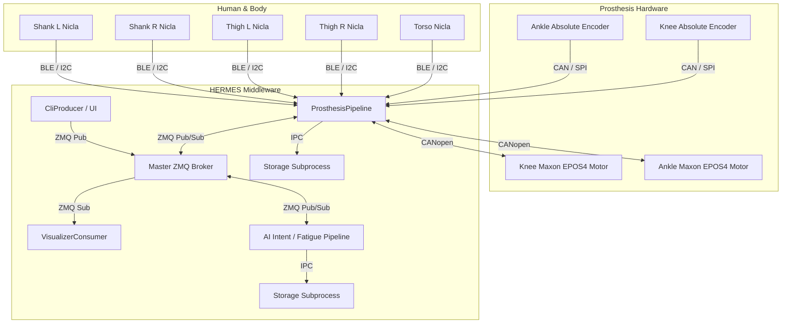
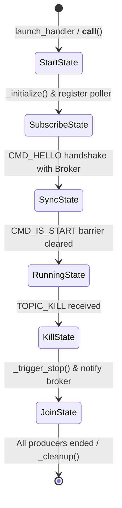

# AidWear Prosthesis & HERMES Integration Guidelines

This document provides a comprehensive technical reference for the **AidWear / OpenAssist / X-LEG** powered prosthesis software stack and its integration with the **HERMES** distributed robotics middleware.

It is designed for new engineering colleagues onboarding onto the project and for **agentic AI coding sessions** to quickly grasp the system architecture, design patterns, hardware interfaces, data contracts, and development practices without needing to parse the entire repository from scratch.

---

## Table of Contents
1. [System & Project Overview](#1-system--project-overview)
2. [Hierarchical Control Architecture](#2-hierarchical-control-architecture)
3. [HERMES Middleware Fundamentals](#3-hermes-middleware-fundamentals)
4. [Hardware & Sensor Interfaces](#4-hardware--sensor-interfaces)
5. [Data Flow & Telemetry Schema](#5-data-flow--telemetry-schema)
6. [Visualizer Architecture & GUI Subsystem](#6-visualizer-architecture--gui-subsystem)
7. [Locomotion State Machines](#7-locomotion-state-machines)
8. [Configuration & Execution](#8-configuration--execution)
9. [Developer & Agent Extension Recipes](#9-developer--agent-extension-recipes)
10. [Critical Gotchas & Architectural Invariants](#10-critical-gotchas--architectural-invariants)

---

## 1. System & Project Overview

**AidWear** is a robotic lower-limb prosthesis controller designed for transfemoral (above-knee) and transtibial (below-knee) amputee locomotion assistance. The physical system features an active powered knee joint and an active powered ankle joint.

Key subsystems:
* **Embedded Controller**: Raspberry Pi 5 onboard the prosthesis running real-time sensing, FSMs, and motor actuation.
* **Actuation**: 2x Maxon CANopen EPOS4 motor drives communicating over CAN-FD bus.
* **Kinematic Sensing**: 2x Joint absolute encoders (Knee, Ankle) and 5x Nicla Sense ME IMUs distributed along the human body (Torso, Left/Right Thighs, Left/Right Shanks).
* **Companion Compute (AI Device)**: NVIDIA Jetson Orin NX (or laptop) running vision/gait AI models for intent recognition and fatigue prediction.
* **Human-in-the-Loop GUI**: Wrist-worn [Android smartphone application](https://github.com/kuleuven-emedia/aidwear-gui) and desktop monitoring dashboards.
* **Coordination Layer**: [HERMES middleware](https://github.com/maximyudayev/hermes) coordinating synchronized multimodal sensing, distributed across devices.



---

## 2. Hierarchical Control Architecture

The prosthesis operates under a 3-tier hierarchical control topology:

```
+-------------------------------------------------------------------+
| High-Level: Adaptive Gait & Assistance                            |
| - Vision (ego) & IMU locomotion mode prediction                   |
| - Assistance level scaling (fatigue / RPE estimation)             |
| - Oversegmentation filtering (raw predictions to control modes)   |
+---------------------------------+---------------------------------+
                                  | Mode & Assistance Scale
                                  v
+-------------------------------------------------------------------+
| Mid-Level: Finite State Machine & Trajectory Generation           |
| - Gait cycle phase estimation (0 - 100%)                          |
| - Sub-phase transition detection (Heel strike, Stance, Swing)     |
| - Normative kinematic trajectory interpolation (Angle, Vel, Trq)  |
+---------------------------------+---------------------------------+
                                  | Target Setpoints (P, V, I)
                                  v
+-------------------------------------------------------------------+
| Low-Level: High-rate Embedded Motor Interface                     |
| - Maxon EPOS4 field-oriented control (FOC) over CAN Bus           |
| - Current / torque loop (high frequency)                          |
| - Joint limit enforcement, damping, and hardware safety trips     |
+-------------------------------------------------------------------+
```

1. **High-Level (AI)**: Operates asynchronously, up to 50 Hz. Predicts upcoming [user intent](/src/hermes/aidwear/ai_intent/pipeline.py) (e.g. transitioning from level walking to stair ascent) and tracks [user fatigue](/src/hermes/aidwear/ai_fatigue/pipeline.py) to dynamically modulate assistive torque.
2. **Mid-Level (FSM & Kinematics)**: Runs deterministically at up to 500 Hz in [ProsthesisHandler](/src/hermes/aidwear/prosthesis/controller/prosthesis_handler.py). Interprets current joint angles and IMU states, determines gait phase, evaluates state transition guards, and generates target joint angle/velocity/torque setpoints. Links to the rest of HERMES sensing system through [ProsthesisPipeline](/src/hermes/aidwear/prosthesis/pipeline.py)
3. **Low-Level (Motor Control)**: Runs on the hardware motor controller at 1 kHz+. Executes closed-loop current/position/velocity control. Controlled by `ProsthesisHandler` through [EposFacade](/src/hermes/aidwear/prosthesis/motor_control/epos_facade.py).

---

## 3. HERMES Middleware Fundamentals

[HERMES](https://github.com/maximyudayev/hermes) (`pysio-hermes`) is a real-time distributed sensing and closed-loop intervention framework built using ZeroMQ and FFmpeg; it provides synchronized, low-latency acquisition and exchange of data across multiple wearable health and assistive devices through the asynchronous and multiprocessing stack, zero-copy data logging through shared memory.

### 3.1 Node Archetypes
Every device in HERMES inherits from `Node`:
* **`Producer`**: Only emits data (e.g. sensor interface like `NiclaSenseMeProducer`, CLI keyboard event emitter). Publishes data to `PORT_BACKEND`.
* **`Consumer`**: Only ingests data (e.g. visualization, centralized logging, or sinking commands/data without feedback) without publishing back to the middleware (e.g. `VisualizerConsumer`). Subscribes on `PORT_FRONTEND`.
* **`Pipeline`**: Ingests multimodal data, performs computation/control, and emits transformed or asynchronously generated data (e.g. `ProsthesisPipeline`). Subscribes on `PORT_FRONTEND`, publishes on `PORT_BACKEND`.

### 3.2 Node Lifecycle Finite State Machine
Every node follows a strict lifecycle FSM driven by `Node.__call__()`:



* **`StartState`**: Calls `self._initialize()`, creates local ZeroMQ sockets, and connects to Broker coordination ports.
* **`SubscribeState`**: Handshakes with Broker using `CMD_HELLO`.
* **`SyncState`**: Waits for the Broker's `CMD_IS_START` signal, guaranteeing all distributed nodes across machines start simultaneously.
* **`RunningState`**: The steady-state event loop. Calls `self._poll()`, which executes `self._on_poll()` when sockets have data. In consumers, this invokes `_process_data(topic, msg)`.
* **`KillState` / `JoinState`**: Gracefully drains remaining in-flight packets, coordinates closure, and executes `_cleanup()`.

> [!CRITICAL]
> **Never override `__call__()` in child Node classes.**
> `Node.__call__()` drives the lifecycle state machine on the node's process main thread. Overriding it breaks node synchronization and produces process exit deadlocks.

### 3.3 ZeroMQ Port Conventions
Default port constants in `hermes.utils.zmq_utils`:
* `PORT_FRONTEND` (`"42070"`): Broker XSUB distributor where local Consumers and Pipelines, and remote Brokers subscribe to for data.
* `PORT_BACKEND` (`"42069"`): Broker XPUB collector where local Producers and Pipelines, and remote Brokers publish data to.
* `PORT_SYNC_HOST` (`"42071"`): REQ/REP synchronization port for local node startup/handshake.
* `PORT_SYNC_REMOTE` (`"42072"`): REQ/REP synchronization port for remote slave hosts startup/handshake.
* `PORT_KILL` (`"42066"`): Broker downstream broadcast socket sending `TOPIC_KILL` to all nodes and remote slave hosts.
* `PORT_KILL_BTN` (`"42065"`): REQ socket to report upstream to the local Broker by nodes of user termination.

---

## 4. Hardware & Sensor Interfaces

### 4.1 Nicla Sense ME IMUs
* **Hardware**: Bosch Sensortec BHI260AP smart sensor hub with integrated IMU.
* **Locations (`NiclaLocation`)**:
  * `torso`
  * `thigh_right`, `thigh_left`
  * `shank_right`, `shank_left`
  * *(Optional expansion: `pelvis`, `foot_right`, `foot_left`)*
* **Connection Modes**: BLE (Bluetooth Low Energy via `bleak`) or I2C.
* **Sampling Rate**: ~90 Hz.
* **Data Fields**:
  * `euler`: 3-axis orientation angles `[Roll, Pitch, Yaw]` in degrees.
  * `acceleration`: 3-axis linear acceleration `[X, Y, Z]` in m/s² or raw units.
  * `gyroscope`: 3-axis angular velocity `[X, Y, Z]` in deg/s.
  * `toa_s`: Time-of-arrival timestamp (float64) referenced to HERMES master clock.

### 4.2 Maxon EPOS4 Motors
* **Hardware**: Maxon brushless DC motors with EPOS4 digital positioning controllers.
* **CAN IDs**:
  * Knee: `can_id: 1` (`MotorId.KNEE`)
  * Ankle: `can_id: 2` (`MotorId.ANKLE`)
* **Interface**: CAN 2.0B via `python-can` (`can0` interface on Linux / PCAN USB on Windows).
* **Control Modes**: ([Complete list](/src/hermes/aidwear/prosthesis/motor_control/epos_commands.py))
  * Position Mode
  * Current Mode
  * Velocity Mode
* **Telemetry Fields**:
  * `position`: Current motor shaft position (float32, QC).
  * `current`: Measured motor current (float32, mA).
  * `velocity`: Motor shaft velocity (float32, RPM).
  * `error`: Error code bitfield (uint8).
  * `toa_s`: Time-of-arrival timestamp (float64) referenced to HERMES master clock.

### 4.3 Joint Absolute Encoders
* **Hardware**: High-resolution 14-bit absolute magnetic encoders directly mounted to the knee and ankle joint axes.
* **Joint IDs**: `EncoderId.KNEE` (`0x201`), `EncoderId.ANKLE` (`0x202`).
* **Telemetry Fields**:
  * `angle`: Absolute joint flexion/extension angle (float32, degrees).
  * `is_error`: Sensor error status flag (bool).
  * `toa_s`: Time-of-arrival timestamp (float64) referenced to HERMES master clock.

---

## 5. Data Flow & Telemetry Schema

All telemetry in HERMES is transmitted as multipart ZeroMQ messages:
1. `topic` (bytes): e.g. `b"prosthesis.nicla_torso"`, `b"prosthesis.motor_knee"`.
2. `payload` (bytes): MessagePack (`msgpack`) serialized dictionary (`NewData`).

### 5.1 Multimodal Packet Dictionary Format
Inside `_process_data(topic, msg)`, `msg` is deserialized and structured as a mapping of bundle names to channel arrays:

```python
msg: NewData = {
    # 1. Nicla IMU Bundles
    "nicla_torso": {
        "toa_s": np.array([[1727191200.1234]], dtype=np.float64),   # Shape (N, 1)
        "euler": np.array([[12.4, -3.1, 45.8]], dtype=np.float32),  # Shape (N, 3)
        "acceleration": np.array([[...]], dtype=np.int16),          # Shape (N, 3)
        "gyroscope": np.array([[...]], dtype=np.int16),             # Shape (N, 3)
        "timestamp": np.array([[104523]], dtype=np.uint32),         # Hardware clock
        "sequence_id": np.array([[452]], dtype=np.uint32),
    },

    # 2. Motor Bundles
    "motor_knee": {
        "toa_s": np.array([[1727191200.1230]], dtype=np.float64),   # Shape (N, 1)
        "position": np.array([[1.45]], dtype=np.float32),           # Shape (N, 1)
        "velocity": np.array([[120.0]], dtype=np.float32),          # Shape (N, 1)
        "current": np.array([[1.85]], dtype=np.float32),            # Shape (N, 1)
        "error": np.array([[0]], dtype=np.uint8),                   # Shape (N, 1)
    },

    # 3. Absolute Joint Encoder Bundles
    "encoder_knee": {
        "toa_s": np.array([[1727191200.1232]], dtype=np.float64),   # Shape (N, 1)
        "angle": np.array([[42.5]], dtype=np.float32),              # Shape (N, 1)
        "is_error": np.array([[False]], dtype=bool),                # Shape (N, 1)
    }
}
```

> [!NOTE]
> `N` represents the number of temporal samples in the packet. When `ProsthesisPipeline` batches packets, `N > 1`. HERMES data always arrives as 2D arrays (`shape (N, C)`, even if `N == 1`).

---

## 6. Visualizer Architecture & GUI Subsystem

The [visualizer](/src/hermes/aidwear/visualizer/consumer.py) provides live interactive PyQt6 + PyQtGraph telemetry plotting.

### 6.1 Subprocess Partitioning Pattern
To prevent GUI rendering (which takes 5–20 ms) from introducing jitter or dropped packets into the sensing and networking thread, the visualizer uses the **HERMES Subprocess Worker Pattern**:

```
[VisualizerConsumer Process] (Main Thread)
  │  - Runs standard HERMES Consumer FSM (StartState -> RunningState -> KillState)
  │  - Receives multimodal telemetry data
  │  - Emits packets to visualization logic via `_process_data()`
  │
  ├─> self._data_queue.put_nowait(msg) (Non-blocking IPC Queue)
  │
[VisualizerGuiHandler Process] (Dedicated GUI Subprocess)
  │  - Owns `QApplication` on its own Main Thread (100% Qt-compliant)
  │  - QTimer drains `_data_queue` every 25-40ms
  │  - Updates `VisualizerMainWindow` 3x3 PyQtGraph subplots
  │  - Detects window close -> signals `_is_windows_closed_event` to stop the experiment
```

### 6.2 Visualizer Component Files
* **`[consumer.py](/src/hermes/aidwear/visualizer/consumer.py)`**: Contains `VisualizerConsumer(Consumer)`. Instantiates `_data_queue = Queue(maxsize=1000)` and spawns the GUI process in `__init__()`. Joins the process in `_cleanup()`.
* **`[handler.py](/src/hermes/aidwear/visualizer/handler.py)`**: Contains `VisualizerGuiHandler`. Invoked via `launch_handler`. Manages `QApplication` lifecycle.
* **`[utils/ui.py](/src/hermes/aidwear/visualizer/utils/ui.py)`**: Contains `VisualizerMainWindow`. Builds the PyQtGraph 3x3 layout, controls toolbar, and executes rolling buffer math.

### 6.3 3x3 Grid Layout
```
+------------------------+------------------------+--------------------------+
| IMU: Torso             | IMU: Thigh Right       | IMU: Thigh Left          |
| Roll / Pitch / Yaw     | Roll / Pitch / Yaw     | Roll / Pitch / Yaw       |
+------------------------+------------------------+--------------------------+
| IMU: Shank Right       | IMU: Shank Left        | Joint Absolute Encoders  |
| Roll / Pitch / Yaw     | Roll / Pitch / Yaw     | Knee Joint & Ankle Joint |
+------------------------+------------------------+--------------------------+
| Motor Positions        | Motor Velocities       | Motor Currents           |
| Knee & Ankle           | Knee & Ankle           | Knee & Ankle             |
+------------------------+------------------------+--------------------------+
```

### 6.4 Rolling Relative Time Axis Math
All 9 subplots share the same synchronized time axis `[-T, 0.0]`:
1. The GUI tracks global `latest_time = max(latest_time, t_sample)`.
2. For each curve, relative x-coordinates are computed via vectorized subtraction:
   $$\mathbf{x} = \mathbf{t}_{\text{buffer}} - \text{latest\_time}$$
3. Since $t \le \text{latest\_time}$, $x \le 0.0$. The latest data point appears at $x = 0.0$ on the right, and older points roll to the left.
4. Samples older than $\text{latest\_time} - T - 2.0\text{s}$ are pruned from the `deque` to maintain constant, bounded memory usage during long experiments.

---

## 7. Locomotion State Machines

State machines are located in `/src/hermes/aidwear/prosthesis/state_machines/`.

### 7.1 Available Ambulation Modes (`ModeEnum`)
* **`IDLE` (`idle.py`)**: Unassisted / transparent damping mode. Motors maintain low impedance or hold position.
* **`WALKING` (`walking.py`)**: Normative level-ground walking. Sub-phases:
  1. *Early Stance*: Controlled knee flexion for shock absorption.
  2. *Mid Stance*: Extension and stability.
  3. *Terminal Stance / Pre-Swing*: Ankle plantarflexion push-off.
  4. *Initial Swing*: Rapid knee flexion for foot clearance.
  5. *Terminal Swing*: Knee extension decelerating before heel strike.
* **`STAIR_ASCENT` (`stair_ascent.py`)**: Stair climb assist with high knee flexion clearance and pull-up torque.
* **`STAIR_DESCENT` (`stair_descent.py`)**: Controlled knee yielding and eccentric lowering.
* **`SIT_TO_STAND` (`sit_to_stand.py`)**: Power extension assist during chair rises.
* **`HURDLE` (`hurdle.py`)**: Elevated foot trajectory for obstacle crossing.

### 7.2 Gait Phase Estimation
Phase $\varphi \in [0.0, 1.0]$ is estimated from shank kinematics and thigh angle phase-portraits:
$$\varphi = \text{atan2}(\dot{\theta}_{\text{thigh}}, \theta_{\text{thigh}})$$
Setpoints are evaluated from parameterized polynomial splines or normative lookup tables indexed by $\varphi$.

---

## 8. Configuration & Execution

HERMES loads configuration YAML files from `run/`.

### 8.1 Example Configuration (`prosthesis_with_visualizer.yml`)
```yaml
host_ip: "127.0.0.1"
is_master_broker: True

logging_spec:
  stream_period_s: 30
  stream_hdf5: True

consumer_specs:
  - package: "aidwear.visualizer"
    class: "VisualizerConsumer"
    node_id: "visualizer"
    settings:
      history_len: 150
      draw_interval_s: 0.04
      dark_mode: True
      time_window_s: 5.0
      data_in_specs:
        - package: "aidwear.prosthesis"
          class: "ProsthesisPipeline"
          node_id: "prosthesis"
          topics:
            - "nicla_torso"
            - "nicla_thigh_right"
            - "nicla_thigh_left"
            - "nicla_shank_right"
            - "nicla_shank_left"
            - "motor_knee"
            - "motor_ankle"
            - "encoder_knee"
            - "encoder_ankle"

pipeline_specs:
  - package: "aidwear.prosthesis"
    class: "ProsthesisPipeline"
    node_id: "prosthesis"
    settings:
      data_out_spec:
        dt: 0.002
        base_assistance: 50.0
```

### 8.2 Launching the Stack
Run using UV and the master CLI:
```bash
# Run complete system (Prosthesis + Visualizer + CLI)
uv run hermes-cli -f run/prosthesis_standalone_cli/prosthesis_with_visualizer.yml

# Run standalone visualizer demo / UI test
uv run python src/hermes/aidwear/visualizer/consumer.py
```

---

## 9. Developer & Agent Extension Recipes

### Recipe A: Adding a New Sensor Modality
1. In `src/hermes/aidwear/prosthesis/data_container.py`:
   Add channels to `ProsthesisDataContainer.__init__()` using `self.add_channel(bundle_name, channel_name, data_type, sample_size, ...)`.
2. In `src/hermes/aidwear/prosthesis/pipeline.py`:
   Read sensor in driver thread, populate dictionary in `_generate_data()`, and call `self._publish(get_time(), new_data)`.
3. In `run/.../*.yml`:
   Add the new topic name under `topics` in the consumer/pipeline `data_in_specs`.
4. In `src/hermes/aidwear/visualizer/utils/ui.py`:
   Add curve references and unpack the new bundle in `_drain_queue_and_update()`.

### Recipe B: Adding a New Locomotion Mode
1. Create state class in `src/hermes/aidwear/prosthesis/state_machines/new_mode.py` inheriting from `BaseStateMachine`.
2. Register the mode in `ModeEnum` in `src/hermes/aidwear/prosthesis/utils/types.py`.
3. Add mode entry/exit transitions in `src/hermes/aidwear/prosthesis/controller/mode_selection.py`.
3. Add inter-mode switching conditions in `src/hermes/aidwear/prosthesis/controller/prosthesis_handler.py`.

---

## 10. Critical Gotchas & Architectural Invariants

### 1. Circular Imports
`hermes.nicla_sense_me.utils.types` and `hermes.aidwear.prosthesis.utils.types` have interdependent references.
* **Invariant**: Always import `NiclaLocation` **BEFORE** importing `EncoderId` or `MotorId` in consumer/pipeline modules:
  ```python
  # CORRECT:
  from hermes.nicla_sense_me.utils.types import NiclaLocation
  from hermes.aidwear.prosthesis.utils.types import EncoderId, MotorId
  ```

### 2. Never Block the Middleware Main Thread
* In any `Consumer`, `Pipeline`, or `Producer`:
  * Never use `time.sleep()` inside `_process_data()` or `_produce_data()`.
  * Never run heavy computations or GUI event loops on the node's main thread.
  * Delegate long-running tasks or isolated GUIs to a child process using `Process(target=launch_handler, ...)`.

### 3. Non-Blocking Queues
* When pushing data from `_process_data()` to a child process queue:
  ```python
  try:
      self._data_queue.put_nowait(msg)
  except Full:
      pass  # Drop telemetry rather than blocking real-time control
  ```

### 4. Windows Qt Main Thread Requirement
* PyQt6 `QApplication` **must** execute on the main thread of its process.
* Spawning the GUI via `launch_handler(VisualizerGuiHandler)` satisfies this by making the GUI handler the entry point of the dedicated subprocess's main thread.

### 5. Multi-Sample Buffer Shapes
* Incoming signals arrive with shape `(N, C)`.
