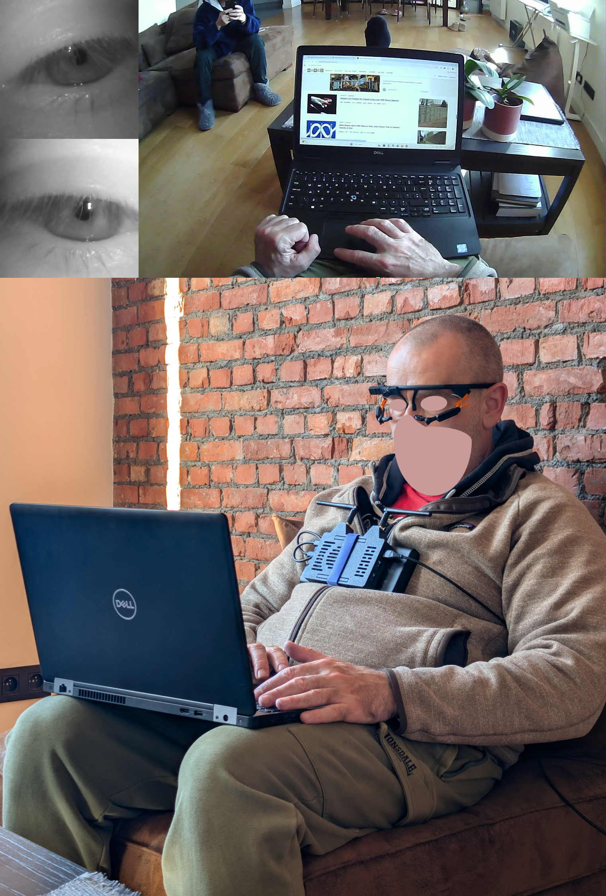

# Step-by-step instructions

1. Connect the router to the internet and power. Turn it on. Wait until the red web light becomes white.
1. Connect the raspberry Pi time server with the short Ethernet cable with transparent blue tips to Port 1 of the router. Power it on.
1. Check that the time server synced up with the Internet time: 
   `timedatectl` -> should say "yes" in the "synchronized" field.
   `sudo systemctl restart chrony` -> to restart the time service if not automatically jumped on startup.
1. Run the `hermes_set_local_NTP.bat` script on the Desktop of the Vicon PC as admin, to make it continuously sync with the local HERMES network.
1. Prepare the Vicon Nexus app with the settings for the Delsys EMGs, so that HERMES can access it during the experiment.
1. Connect the Camera PC to power and wired ethernet between the bottom port and the Port 2 of the router. Boot up.
1. Remote desktop into the Camera PC from your laptop and run the Pylon Viewer application to setup the angles of the external cameras to cover the whole course.
1. Connect to one camera at a time, press continuous capture button for the live stream, angle the cameras, adjust the focal distance for a sharp image, and iris opening for exposure. 
1. Test the system throughput by connecting to all cameras in Pylon Viewer and setting all 4 to continuous streaming. Observe the FPS at the bottom left of each camera preview window (must be 30.0).
1. If the FPS is not exactly 30 for all 4 cameras, BIOS settings were reset and must boot into it to set the correct, Turbo Mode, fan speed, PEG port and PCI configurations.
1. Verify that the camera PC discovered and synced to the local time server (no settings require changes) -> `w32tm /stripchart /computer:10.220.25.99 /samples:720 /period:5 /dataonly` should show offsets under 1ms.
1. Adjust the smartglasses to the participant by first connecting to any device that has Pupil Capture app installed (e.g. researcher's laptop, NUC, camera PC).
1. Open Pupil Capture and verify focal distance of the ego view, and the eye cameras. Gently twist CW or CCW to adjust the focal distance: changes to focal distance of eye are needed when sliding the orange and black hands of the eye camera to/from the face, and on accidental 
1. Adjust the angle of the eye cameras to capture the complete range of motion of the pupils, and the angle of the ego camera to capture the vertical range of view, where interactions between subject and environment are of interest, like:
   

      
   

   The eye tracker uses orange extension to position the eye cameras more toward the eye to capture complete pupil motion range; the eye and ego images are sharp at the focal distance of interest. No blur/smudges on the ego video when looking toward the light.
   The hands of the user are clearly visible to track interaction with the environment, while covering sufficent space in the peripheral vision, both vertically and horizontally.
1. Wipe camera lenses gently with a lens cloth if there are any smudges.
1. Disconnect the eye tracker from the device and connect to the Jetson in preparation for the experiment.
1. Boot up NUC for TMSi and MVN Analyze connection. Wire both systems to it.
1. Launch the MVN Analyze app, enter detailed body measurements and the model type (really do do this, data is orders of magnitude better), change the sample rate to 60Hz, and discover all the Awinda sensors.
1. Connect the TMSi and dock it.
1. Check that the NUC connected to the local NTP server, similar to the camera PC.
1. Boot the exo and check with `timedatectl` and `chronyc sources -v` that it auto synced to the local NTP server, and that it connected to the HERMES WiFi. This is done automatically and never needed fiddling.
1. Run `sudo systemctl restart chrony` if it hasn't auto synced.
1. Run the standalone local exo with CLI option on the exo out of the `~/Documents/Revalexo/run/exo_standalone_cli` folder, to setup all the fiddly CAN sensors (power monitoring unit) that require onetime setup after each boot. End the experiment as normal shortly after it started.
1. Connect the Jetson to the powerbank on the high-power orange port that can give up to 140W. Press on the button of the powerbank and plug into the Jetson.
1. Connect the smartglasses into the USB port on the Jetson after mounting the Jetson and powerbank onto the velcro on the back of the exo, once exo is on the participant's body.
1. Check that Jetson auto-synced to the local time server, similar to the exo. Also doesn't require fiddling.
1. Instrument the experiment from the master device - the NUC, by remote desktoping into it or by directly controlling from the screen and keyboard.
1. Change the type of the experiment to something like "Real" or "Beta" in the master launch `.bat` scripts under the `run` folder.
1. Launch the corresponding experiment on the NUC only by running the desired script from the root folder of revalexo project on the NUC, e.g. - `run\ai_intent_imu\master.bat`.
1. This will spawn separate terminal windows with SSH tunnels to each federated device. Authenticate with the corresponding password of that device (don't wait for too long). 
1. Each device will seprately configure all local sensors and systems, and will wait for each other to handshake and orchestrate a synchronous start of the experiment.
1. The exo will prompt to press 'm' to calibrate the initial IMU offsets: have the person hold the neutral pose.
1. Once you see "GO" (will happen at the same instant in all terminal windows), you can begin with the experiment.
1. From the NUC's terminal window, you can enter keyboard events (adjust logic to parse events correctly), to record synchronized RPE scores from the participant as they walk around the course.
1. In case of unsafe behavior of the exo, press 's' in the terminal of the exo - it will override any AI or manual predictions and keep the exo in Idle (unassisted) mode, until you toggle 's' again. This happens instantly.
1. At the end of the experiment, press 'Q' to safely end the experiment and flush any remaining data. Wait until all terminal windows closed by themselves and the NUCs main terminal exited with a Good Bye <3 message.
1. Run the launch script on the master as many times as you wish, changing the name of the experiment for each new subject (e.g. `-e project=RevalexoAiIntentImu type=Beta subject=4`) it will auto-increment experiments for the same subject, to not overwrite any data, nor to collide with existing folders on remote devices.  
1. At the end of the day, run the `hermes_unset_local_NTP.bat` script on the Desktop of the Vicon PC as admin, to undo the syncing to the local HERMES network, so that other lab users can use the device as expected.

## Useful commands

### Add SSH key to Linux device for GitHub
Activate the SSH agent `eval $(ssh-agent -s)`

Add the SSH key `ssh-add ~/.ssh/id_ed25519_<your_key>`
Keep the SSH key passwords secure and only known to you, else someone can gain root access to your GitHub and wreak havoc.

### Force time sync
Run these commands if time is not syncing, before any experiments.

`w32tm /resync` - Windows

`sudo systemctl restart chrony` -> Linux

### (Linux) Manually set the date and time (YYYY-MM-DD HH:MM:SS)

`sudo timedatectl set-time '2026-04-10 10:15:00'`

`sudo date -s "10 APR 2026 10:15:00"`

### Verify configuration

`w32tm /query /configuration` - Windows

`timedatectl` - Linux

### Check the NTP peer list

`w32tm /query /peers` - Windows

`chronyc sources -v` - Linux

### Track the synchronization between devices

`w32tm /stripchart /computer:10.220.25.99 /samples:720 /period:5 /dataonly` - Windows

`chronyc tracking` - Linux
