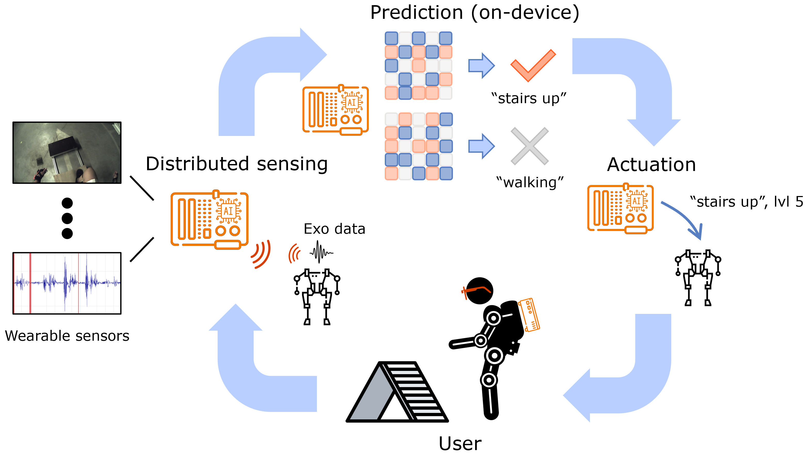
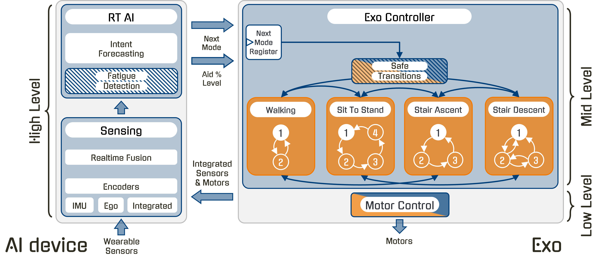
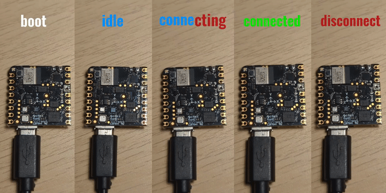

# Revalexo
Exoskeleton controller, wrapped with KU Leuven's [HERMES](https://github.com/maximyudayev/hermes) framework to communicate to an external AI controller for intent-based locomotion mode selection and fatigue-based support level moderation.

The exo uses a hierarchical controller, with each layer controlling the layer below it:
- High-level -> AI-based intent (ambulation mode) and fatigue forecasting
- Mid-level -> intra-mode normative kinematics trajectory tracking
- Low-level -> field-oriented motor control

<p align="center">
  
  
</p>

These mid-level state machines are defined based on the derived locomotion kinematic equations for the specific rigid body, within the degrees-of-freedom it offers, to track a desired normative motion trajectory with a desired frequency response of the control system.

## Installation
### General devices
Use [UV](https://docs.astral.sh/uv/getting-started/installation/#installing-uv) Python package and project manager to create, activate, and configure the environment on the corresponding device:

| Device | Command |
| - | - |
| Exoskeleton - RPi 5 | `uv sync --extra exo` |
| AI device - test laptop / RPi 5 | `uv sync --extra ai` |

### Jetson Orin NX
We are using a Jetson Orin NX 16GB on a [Seeed Studio A608 carrier board](https://www.seeedstudio.com/Jetson-A608-Carrier-Board-for-Orin-NX-Orin-Nano-Series-p-5853.html).

#### Prerequisites
* JetPack 6.2
* CUDA 12.6
* LT 36.4.3
* Python 3.10.12
* FFmpeg 8.1 ([Jetson patch](https://github.com/Keylost/jetson-ffmpeg))

Follow the Seeed Studio [instructions](https://wiki.seeedstudio.com/reComputer_A608_Flash_System/) to flash the board.

> [!IMPORTANT]
> Update the contents of the tools shell scripts to set a custom username and password, and to activate VNC. Take note of the IP addresses for the IPoverUSB and the Eth interfaces for easy connection w/o a display.

> [!IMPORTANT]
> Use a fan on the Jetson, or it will thermal reset.

> [!IMPORTANT]
> Remove the jumper after flashing the board to boot into the OS.

> [!WARNING]
> After flashing the Jetson, installing some of the following packages or running may not work due to the lack of some NVIDIA libraries. Install a matching JetPack SDK or simply drop the error trace into Gemini to help find NVIDIA Jetson forums that list the name of the shared libraries to install with `apt-get`. 

#### Step-by-step
1. Follow the instructions to compile FFmpeg (8.1) from source with the [Jetson-specific patch](https://github.com/Keylost/jetson-ffmpeg) for hardware-accelerated video handling.
1. Clone the Revalexo project:
   ```bash
   git clone git@github.com:kuleuven-emedia/revalexo.git
   ```
1. Create a virtual environment:
   ```bash
   python -m venv .venv
   ```
1. Install Numpy 1.26.4 to build UVC wheel for Pupil Labs Core smartglasses:
   ```bash
   source .venv/bin/activate && pip install numpy==1.26.4 && cd ..
   ```
1. Follow the instructions to compile UVC for the [Pupil Labs Core smartglasses](https://github.com/pupil-labs/pyuvc#install-from-source) and to run it as non-user.
1. Install the Jetson-optimized PyTorch toolchains:
   ```bash
   cd ./revalexo && pip install -r jetson_requirements.txt
   ```
1. Setup Chrony NTP client (`/etc/chrony/chrony.conf`) to prefer to poll the local network NTP server with `minpoll` and `maxpoll` of 4, like: `server 10.220.25.99 iburst minpoll 4 maxpoll 4 prefer`.
   
   Set the public servers to less frequent polling to not abuse them and to not get blacklisted: `pool ntp.ubuntu.com iburst maxsources 4 minpoll 10 maxpoll 15`.
1. Setup a DHCP server on the `enP1p1s0` ethernet interface for 10.220.24.1/24.

## Running
From the project root directory run the relevant convenience launcher:
| Device | Command |
| - | - |
| Standalone exo w/ manual CLI control | `. run/exo_standalone_cli/exo.sh` |
| Standalone exo w/ manual GUI app control | `. run/exo_standalone_gui/exo.sh` |
| Dual-controller AI setup w/ HERMES | `. run/ai_<model_type>/ai.sh` |

This will automatically wrap the corresponding `exo.yml`/`ai.yml` configuration into the rest of the HERMES execution environment to seemlessly interconnect different sensing, processing, and actuating components. It will also update experiment metadata to create a unique data folder with recorded files.

> [!IMPORTANT]
> The dual-controller setup automatically spawns the HERMES orchestrator between the AI device and the exo embedded controller. Even better, it lets you launch distributed sensing setup from your laptop and have remote shell terminals pop-up to interact with each HERMES-enabled device throughout the experiment.

> [!WARNING]
> To stop the exo for safety reasons, without killing the experiment, enter 'S' in the terminal of the experiment orchestrator (e.g. researcher's laptop that spawned remote terminal shell for exo control - applicable to any mode of exo operation), or the VNC remote desktop session, for HERMES-orchestrated experiments and local on-device running, respectively. 

> [!NOTE]
> (Discouraged) You can also generically run the HERMES CLI to manually configure in-line any desired arguments `hermes-cli -o ./data -f run/exo_<type>.yml -e project=<PROJECT> trial=<X>`
> Make sure to update the `trial` number on every launch of the script. It's used to create unique folders for data collection that avoid overwriting previously collected data. HERMES system will not allow you to run the same experiment name twice, to protect the previously collected data.

### Manual standalone operation
When running in [standalone CLI mode](#option-1-local-shell-terminal), press the activity id on the keyboard, followed by 'Enter' to manually switch the exo controller to it:
| Activity | ID |
| - | - |
| Idle | 0 |
| Walking | 1 |
| Sit-To-Stand | 2 |
| Stair Ascent | 3 |
| Stair Descent | 4 |

And enter a percentage of fatigue to manually update the level of assistance of the exo controller by '%', followed by number 0-100, followed by 'Enter' (e.g. `$> %70`).

## Structure
The exoskeleton-specific files:
```
└──hermes/
   ...
   └──revalexo/
      ├──cli/
      │  ├──producer.py
      │  └──stream.py
      ├──gui/
      │  ├──utils/
      │  │  └──types.py
      │  ├──producer.py
      │  └──stream.py
      ├──ai/
      │  ├──utils/
      │  │  ├──configs/
      │  │  ├──models/
      │  │  ├──weights/
      │  │  ├──config.py
      │  │  ├──datastructures.py
      │  │  ├──handler.py
      │  │  ├──transforms.py
      │  │  ├──types.py
      │  │  └──utils.py
      │  ├──pipeline.py
      │  └──stream.py
      ...
      └──exo/
         ├──controller/
         │  ├──exo_handler.py
         │  └──mode_selection.py
         ├──state_machines/
         │  ├──base.py
         │  ├──idle.py
         │  ├──sit_to_stand.py
         │  ├──stair_ascent.py
         │  ├──stair_descent.py
         │  └──walking.py
         ├──can_control/
         │  ├──emulator_cubemars.py
         │  ├──motor_cubemars.py
         │  └──pmu_mateksys.py
         ├──sensors/
         │  ├──nicla/
         │  │  ├──abstract_backend.py
         │  │  ├──ble_backend.py
         │  │  ├──i2c_backend.py
         │  │  └──types.py
         │  └──can_backend.py
         ├──utils/
         │  ├──types.py
         │  └──utils.py
         ├──pipeline.py
         └──stream.py
         ...
```
### Exoskeleton
 - `exo_handler.py` is the main AsyncIO routine that manages the functionality of the exoskeleton:
    1. Manages a persistent BLE/I2C connection to the onboard Nicla Sense ME motion sensors;
    1. Manages a persistent CAN connection to the onboard motors;
    1. Reads incoming IMU, motors, and telemetry data;
    1. Indicates upstream AI/UI intent transitions to `mode_selection` to trigger locomotion mode change;
    1. Continuously passes data to the currently active locomotion mode state machine to control the exo;
 - `mode_selection.py` contains the macro state machine logic that manages safe transitions between the different locomotion modes of the exo, based on the upstream high-level AI/UI controller.
 - `state_machines/` folder contains all state machines logic for each locomotion mode FSM (states, transitions, gait phase estimation, impedance/torque control commands to the motors, etc.).
 - `types.py` defines convenience datatypes that ensure safe typing between different coupled components of the system.
 - `utilities.py` shared static logic, reusable by multiple distinct components.

#### Inputs
 - `can_backend.py` decouples CAN motor/PMU data receiving and parsing logic for both, virtual (testing) and physical (exo) CAN setups.
 - `nicla/<ble/i2c>_backend.py` decouples specified Nicla Sense ME physical connection (BLE or I2C) with a uniform plug-and-play interface.
 - `nicla/types.py` defines convenience datatypes for the Nicla Sense ME IMU sensors to reuse throughout the system.

#### Outputs
 - `motor_cubemars.py` contains all functions required to communicate with and control the specific motors via CAN.
 - `pmu_mateksys.py` placeholder to control the MatekSys DroneCAN power monitor unit.
 - `emulator_cubemars.py` contains a callable meant to be run in a thread/process to create a virtual CAN bus that generates fake motor data for validation of the overall system logic.

### HERMES
#### Exoskeleton
 - `exo/pipeline.py` HERMES Node integrating exoskeleton with the rest of the sensing and companion computing ecosystem.
 - `exo/stream.py` HERMES datastracture containing all the data generated by the exoskeleton.

#### (Option #1) Local shell terminal
 - `cli/producer.py` HERMES Node enabling CLI based manual selection of intent [0, 4] and fatigue level [%0, %100] (must start from %, will autoclip values to 0-100 range), when using the exo in standalone mode.
 - `cli/stream.py` HERMES datastracture containing all valid CLI entries of intent and fatigue.

#### (Option #2) Remote phone GUI
 - `gui/producer.py` Android smartphone app enabling manual selection of intent [0, 4] and fatigue level [0, 100] (will autoclip values to 0-100 range), when using the exo with a user-friendly smartphone interface.
 - `gui/stream.py` HERMES datastracture containing all valid GUI entries of intent and fatigue.

#### (Option #3) Companion AI device
 - `ai/pipeline.py` PyTorch model enabling automated selection of intent [0, 4] and fatigue level [0, 100], when using the exo in end-to-end automated approach.
 - `ai/stream.py` HERMES datastracture containing all valid AI predictions of intent and fatigue.
 - `ai/utils/` Folder contains all the multimodal AI constructors and helping utilities to compose PyTorch processing pipelines for live inference.


### Nicla Sense ME
The `exo.yml` file offers an option to configure the system to use [BLE or I2C](exo.yml#L45) for communication with the onboard [Nicla motion sensors](https://docs.arduino.cc/hardware/nicla-sense-me/). The `device_mapping` must be correpsondingly selected (commented/uncommented) and updated with the correct MAC addresses (in the case of BLE).

Use [PlatformIO](https://platformio.org/) to program and debug the firmware as needed, instead of the limited Arduino IDE.

#### (Option #1) - `BLE`
Uses the `bleak` package on the Raspberry Pi to receive wireless Bluetooth Low Energy data packets from the Nicla Sense ME devices. Quality is subject to RF interference from other devices, throughput limitation, BLE issues, lack of continuous synchronization between devices.

The exo uses the integrated motion sensors in a "Push" strategy, where the sensors push the latest motion information into the exo, to drive its internal logic. The exo uses the most up-to-date and lowest latency kinematics knowledge, without any attempts at syncrhonizing data. This allows it to maintain tight soft realtime guarantees.

The [BLE firmware](sensors_firmware/nicla_ble/nicla_ble.ino) compiles with flags that enable desired modalities - by default, gyroscope and Euler orientation data.

The sensors visualize the state of the sensors with the onboard LED for easier troubleshooting and validation of the health of the exoskeleton.



> [!IMPORTANT]
> Current gyroscope + euler configuration (with 9 bytes of metadata) is 27 total bytes/packet, practically limited to 40Hz for 5 concurrently streaming wireless sensors - important for the bandwidth estimation of the mid-level controller and the overall system.

#### (Option #2) - `I2C`
The integrated motion and environment sensors are configured to use the [TWIS1](https://docs-be.nordicsemi.com/bundle/nRF52832_PS_v1.9/raw/resource/enus/nRF52832_PS_v1.9.pdf#%5B%7B%22num%22%3A776%2C%22gen%22%3A0%7D%2C%7B%22name%22%3A%22XYZ%22%7D%2C56.692%2C752.879%2Cnull%5D) peripheral for I2C communication, and exposed via the ESLOV connector.

Communicates to each Nicla Sense ME over a shared I2C bus on the [ESLOV connector (p.4)](https://docs.arduino.cc/resources/pinouts/ABX00050-full-pinout.pdf), via the Raspberry Pi's [`busio`](https://docs.circuitpython.org/en/latest/shared-bindings/busio) package.
To avoid polluting the I2C bus and wasting Pi's resources, each Nicla indicates via an interrupt that new data is available to be read.
The Raspberry Pi then accesses the corresponding device by its I2C address to retrieve the new (burst) data.

> [!IMPORTANT]
> Make sure to wire the INT pin (`P0_19`) of each of the Nicla's 5-pin ESLOV connectors to the Raspberry Pi's digital GPIO's [31](https://pinout.xyz/pinout/pin31_gpio6/), [11](https://pinout.xyz/pinout/pin11_gpio17/), [13](https://pinout.xyz/pinout/pin13_gpio27/), [15](https://pinout.xyz/pinout/pin15_gpio22/), and [16](https://pinout.xyz/pinout/pin16_gpio23/), in any order, but consistent with the specification in the [`exo.yml`](exo.yml#L54-L69) file. This does not conflict with the pin occupation of the attached [CAN-FD HAT](https://www.waveshare.com/wiki/2-CH_CAN_FD_HAT#Interfaces). E.g.:
> | Nicla | Raspberry Pi 5 pin | I2C address |
> | - | - | - |
> | `torso` | [GPIO6 (pin 31)](https://pinout.xyz/pinout/pin31_gpio6/) | 0x11 |
> | `thigh_right` | [GPIO17 (pin 11)](https://pinout.xyz/pinout/pin11_gpio17/) | 0x12 |
> | `shank_right` | [GPIO27 (pin 13)](https://pinout.xyz/pinout/pin13_gpio27/) | 0x13 |
> | `thigh_left` | [GPIO22 (pin 15)](https://pinout.xyz/pinout/pin15_gpio22/) | 0x14 |
> | `shank_left` | [GPIO23 (pin 16)](https://pinout.xyz/pinout/pin16_gpio23/) | 0x15 |

> [!IMPORTANT]
> Also make sure to flash each Nicla with the right firmware and uniquely addressable via the [`I2C_ADDRESS`](sensors_firmware/nicla_i2c/nicla_i2c.ino#L5) macro, consistent with the address specified in the `exo.yml` file.

The standard I2C interface on the Raspberry Pi 5 does not support clock stretching. Nicla's non-deterministic threaded processing does not timely detect the incoming I2C request and doesn't acknowledge transactions. Enable an alternative high-speed I2C interface on the Pi under by adding into the boot configuration file `/boot/firmware/config.txt`, and wiring SDA to [GPIO4 (pin 7)](https://pinout.xyz/pinout/pin7_gpio4/) and SCL to [GPIO5 (pin 29)](https://pinout.xyz/pinout/pin29_gpio5/), both of which conveniently do not interfere with the CAN-FD hat. No external pull-up resistors are needed.
```
dtoverlay=i2c2-pi5,pins_4_5,baudrate=400000
```

Restart and check if the kernel module is enabled with:
```bash
ls /dev/i2c-2
```

Install support tools for CLI-based verification. Will help detect if slave devices are not properly connected.
```bash
sudo apt-get install i2c-tools
```

Program all the Nicla devices in PlatformIO or Arduino IDE.
Run the convenient utility to detect if all devices are connected to the bus and are detected by the Pi:
```bash
i2cdetect -y 2
```

> [!WARNING]
> Verify signal integrity on the I2C bus. The wire harness packs SCL and SDA unshielded wires tightly together and at high clock speeds (400kHz) may cause cross-talk.

##### Nicla Sense ME
The integrated motion and environment sensors are configured to use the [TWIS1](https://docs-be.nordicsemi.com/bundle/nRF52832_PS_v1.9/raw/resource/enus/nRF52832_PS_v1.9.pdf#%5B%7B%22num%22%3A776%2C%22gen%22%3A0%7D%2C%7B%22name%22%3A%22XYZ%22%7D%2C56.692%2C752.879%2Cnull%5D) peripheral for I2C communication, and exposed via the ESLOV connector. Use [PlatformIO](https://platformio.org/) to program and debug the firmware as needed, to validate that I2C commands are received and correctly interpreted.

> [!IMPORTANT]
> The internal processing of the Nicla's RTOS stretches the I2C clock for ~500us per transaction. Consider batching multiple queued up samples into a single transaction to mask latency with throughput. This implies updating firmware and balancing the requested sample rate with the number of connected devices.

## Networking
| device | eth0 | wlan0 |
| - | - | - |
| AI | 10.220.24.101/24 | 10.220.25.101/24 |
| Exo | 10.220.24.102/24 | 10.220.25.102/24 | 
| Phone GUI | - | 10.220.25.105/24 |

## Testing (Linux / Windows)
For benchtop testing of the code (state machines, AI, new motion sensors fimrware, etc.) CAN communication to/from motors is simulated by the `emulator_cubemars` via the [`is_emulate_can`](exo.yml#L79) flag in the configuration `exo.yml` file. The emulator is automatically launched by the `exo_handler` as a subprocess, once the flag is set to `True`. It creates a virtual CAN network using the [`virtualcan`](https://github.com/windelbouwman/virtualcan/tree/master) package.

Install the `virtualcan` package in a folder outside the current project:
```bash
git clone https://github.com/windelbouwman/virtualcan.git <path_to_new_virtualcan_folder>
```

Install first the general Python CAN package, then the cloned virtualcan package into the current virtual environment:
```bash
uv pip install <path_to_new_virtualcan_folder>/python
```

Install [Cargo and Rust](https://doc.rust-lang.org/cargo/getting-started/installation.html) to locally host a CAN simulation server (mandatory):
```bash
curl https://sh.rustup.rs -sSf | sh
```

Launch a virtualcan server in a separate terminal window, to enable simulated inter-process CAN communication between `exo_handler` and `emulator_cubemars`:
```bash
cd <path_to_new_virtualcan_folder>/rust/server
cargo run --release -- --port 18881
```

Run the launch script the same way as for actual operation, from VSCode or via the bash script.
```bash
. run/exo_<type>.sh
```
