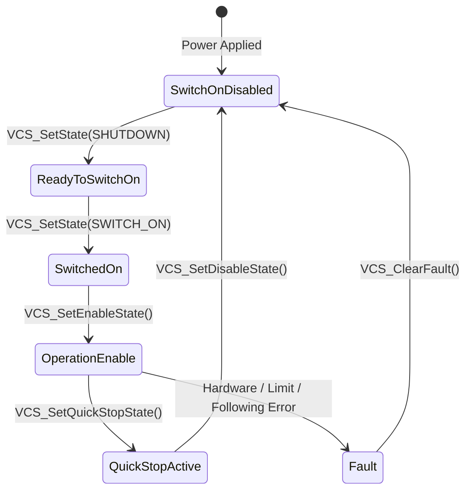

# Maxon EPOS4 Firmware Specification Guide — Robotics Use Cases & Command Workflows

> **Reference Document**: Maxon EPOS4 Firmware Specification (rel12772, Document Edition 2025-05)  
> **Target Domain**: Wearable Robotics (Powered Exoskeletons, Active Prostheses, Orthoses) & Humanoid Robotics (Bipedal Locomotion, Whole-Body Control, Compliant Manipulators)  
> **Accompanying Python Wrapper**: [`motor_epos.py`](/src/hermes/aidwear/prosthesis/can_control/motor_epos.py)  
> **Command Library Reference**: [`docs/epos_command_library.md`](/docs/epos_command_library.md)

---

## 1. Executive Summary & Control Architecture

The Maxon EPOS4 motor controller is a high-performance digital positioning drive designed for brushless (EC / BLDC) and brushed DC motors. In advanced robotics - specifically **wearable robotics** (such as powered transfemoral knee and transtibial ankle prostheses, lower-limb walking exoskeletons) and **humanoid robotics** (bipedal walkers, torque-controlled robot arms) - the drive bridges the gap between high-level robot intelligence and low-level physical dynamics.

### Division of Responsibilities
```
┌────────────────────────────────────────────────────────────────────────────┐
│                   High-Level Host / Companion Computer                     │
│       (Embedded Linux, Python / ROS2 / Whole-Body Controller / MPC)        │
├────────────────────────────────────────────────────────────────────────────┤
│  • Ambulation state machines (Stance, Walking, Sit-to-Stand, Stair Climb)  │
│  • Human intention detection (EMG, IMU, Ground Reaction Sensors)           │
│  • Virtual impedance / admittance model: τ = K_p·Δθ + K_d·Δθ_dot           │
│  • Trajectory generation & Quadratic Programming (QP) force allocation     │
└─────────────────────────────────────┬──────────────────────────────────────┘
                                      │ CANopen / USB / EtherCAT
                                      ▼
┌────────────────────────────────────────────────────────────────────────────┐
│                   Maxon EPOS4 Drive Firmware (On-Drive)                    │
├────────────────────────────────────────────────────────────────────────────┤
│  • CiA 402 Power State Machine (Safety, Quick Stop, Fault Management)      │
│  • Field-Oriented Control (FOC) current loop executed at up to 25 kHz      │
│  • Onboard trajectory interpolator & position/velocity closed loops        │
│  • I²t thermal motor overload protection & hardware limit monitoring       │
│  • Dual-loop control (motor commutation encoder + joint absolute sensor)   │
└─────────────────────────────────────┬──────────────────────────────────────┘
                                      │ 3-Phase PWM / Encoder Feedback
                                      ▼
                      [BLDC Motor + Gearbox + Joint]
```

---

## 2. Operating Mode Decision Matrix for Robotics

The EPOS4 firmware provides several distinct modes of operation. Choosing the correct mode depends on where the trajectory planning occurs and what dynamic behavior is required:

| Operating Mode | CiA 402 Code | Trajectory Generator | Primary Controlled Variable | Typical Wearable & Humanoid Robotics Use Case | Latency & Frequency Requirement |
| :--- | :--- | :--- | :--- | :--- | :--- |
| **Cyclic Synchronous Torque (CST) / Current Mode (CM)** | `-3` (CM) / `10` (CST) | External Master | Motor Current / Joint Torque | **Impedance control, stance phase compliance, humanoid whole-body balance (WBC), zero-gravity / transparent backdrivability.** | High update rate (100 Hz – 1 kHz) |
| **Cyclic Synchronous Position (CSP)** | `8` | External Master | Joint Position | **Real-time bipedal walking trajectory tracking, dynamic arm reaching with inverse kinematics computed on master.** | Periodic sync (100 Hz – 1 kHz) |
| **Interpolated Position Mode (IPM)** | `7` | Internal (from PVT Spline Buffer) | Position / Velocity / Time | **Multi-axis coordinated arm trajectories, gait swing phase profiles streamed without strict real-time bus jitter constraints.** | Buffer streaming (non-strict cycle) |
| **Profile Position Mode (PPM)** | `1` | Internal (Trapezoidal / S-Curve) | Joint Position | **Predefined point-to-point transitions: sit-to-stand movement, sitting down, swing-phase reset, robotic gripper open/close.** | Event-driven (single command) |
| **Profile Velocity Mode (PVM)** | `3` | Internal (Ramped Velocity) | Joint Velocity | **Exoskeleton joint test-bench continuous cycling, wheeled biped mobile base propulsion.** | Event-driven (single command) |
| **Homing Mode (HM / HMM)** | `6` | Internal | Reference Calibration | **Power-on joint zero calibration using mechanical hard-stop current threshold (sensorless zeroing).** | Setup / initialization only |

---

## 3. Detailed Operating Modes & Robotics Use Cases

### 3.1 Current / Torque Mode (CM & CST) — Compliance & Dynamic Interaction

#### What It Does
In Current Mode, the drive's trajectory generator and position/velocity loops are bypassed. The high-level controller directly commands motor current (in milliamperes, proportional to output torque via motor torque constant $K_t$ and gear ratio $N$):
$$	au_{joint} = I_{motor} \cdot K_t \cdot N \cdot \eta$$
The drive executes high-bandwidth Field-Oriented Control (FOC) at **25 kHz**, regulating phase currents with minimal ripple.

#### Why It Is Critical in Wearable & Humanoid Robotics
1. **Virtual Impedance Control (Spring-Damper Dynamics)**:
   In active leg prostheses (e.g., transfemoral knee and ankle), the joint must not act like a rigid industrial actuator. During heel-strike and early stance, the knee must compliantly yield (stance flexion) to absorb ground shock, mimicking biological quadriceps muscle action:
   $$	au_{knee} = K_{stance} \cdot (	heta_{equilibrium} - 	heta) - D_{stance} \cdot \dot{	heta}$$
2. **Transparent Backdrivability & Zero-Torque Floating**:
   When the user is free-swinging or standing still, commanded torque is set to zero (`current_ma = 0`), allowing the motor to backdrive transparently with minimal resistance.
3. **Whole-Body Impulse Control (Humanoids)**:
   Humanoid balance controllers solve Quadratic Programs (QP) to compute desired ground reaction forces, outputting joint torques at 250–1000 Hz.

#### Associated Python Commands
- `set_operation_mode(handle, motor_id, EposOperationMode.CURRENT)`
- `activate_current_mode(handle, motor_id)`
- `cm_set_current_must(handle, motor_id, current_ma)`
- `get_current(handle, motor_id)` / `get_current_avg(handle, motor_id)`

---

### 3.2 Cyclic Synchronous Position (CSP) & Interpolated Position (IPM) — Coordinated Kinematics

#### What It Does
- **CSP**: The external master controller computes target positions cyclically (e.g., every 1 ms or 10 ms). The EPOS4 executes internal position and velocity loops to track this moving target, with optional velocity and torque feedforward.
- **IPM**: The master sends Position-Velocity-Time (PVT) cubic spline coordinate points into an internal FIFO buffer on the drive. The drive interpolates smooth, third-order polynomials between buffer points.

#### Why It Is Critical in Wearable & Humanoid Robotics
1. **Swing Phase Foot Clearance**:
   During the swing phase of gait, the prosthetic foot must follow a strict kinematic trajectory to avoid toe stubbing while preparing for heel strike.
2. **Multi-Axis Reaching & Manipulation**:
   In multi-DOF humanoid arms, all joints must reach intermediate waypoints simultaneously. IPM buffers allow smooth multi-axis coordinated motion even over non-deterministic communication channels (e.g., standard CAN or USB) without communication jitter causing jerk.

#### Associated Python Commands
- `activate_interpolated_position_mode(handle, motor_id)`
- `ipm_set_buffer_parameter(handle, motor_id, underflow_limit, overflow_limit)`
- `ipm_clear_buffer(handle, motor_id)`
- `ipm_add_pvt_value(handle, motor_id, position, velocity, time_delta_ms)`
- `ipm_start_trajectory(handle, motor_id)` / `ipm_stop_trajectory(handle, motor_id)`
- `ipm_get_status(handle, motor_id)` *(checks underflow/overflow warnings)*

---

### 3.3 Profile Position Mode (PPM) — Standalone Trajectory Execution

#### What It Does
The drive uses an internal trajectory generator with linear (trapezoidal) or sinusoidal (S-curve) ramps. The host sets `Target Position`, `Profile Velocity`, `Profile Acceleration`, and `Profile Deceleration`. Once triggered, the EPOS4 autonomously navigates the motor to the target.

#### Why It Is Critical in Wearable & Humanoid Robotics
1. **Discrete Posture Adjustments**:
   Triggering a sitting or standing transition where the trajectory is fixed, allowing the host CPU to handle vision, telemetry, or user interface tasks without running a 1 kHz motion loop.
2. **Safety Emergency Retract**:
   Returning the joint to a safe neutral position if an upper-level software exception occurs.

#### Associated Python Commands
- `activate_profile_position_mode(handle, motor_id)`
- `ppm_set_position_profile(handle, motor_id, velocity, acceleration, deceleration)`
- `ppm_move_to_position(handle, motor_id, position, is_absolute=True, is_immediately=True)`
- `ppm_halt_position_movement(handle, motor_id)`
- `wait_target_reached(handle, motor_id, timeout_ms)`

---

### 3.4 Homing Mode (HMM) — Sensorless Hard-Stop Zeroing

#### What It Does
Establishes the mechanical reference point (zero index) of the joint. Crucially, the EPOS4 firmware supports **Current Threshold Homing** (Methods `-1`, `-2`, `-3`, `-4`). The motor drives slowly toward a mechanical end-stop until current reaches a configured threshold, designating this position (plus an optional offset) as the home coordinate.

#### Why It Is Critical in Wearable & Humanoid Robotics
1. **Elimination of External Limit Switches**:
   Prosthetic knee/ankle joints and compact humanoid finger/wrist joints have strict weight and packaging constraints. Microswitches and external optical sensors add fragile cabling that is susceptible to shock and moisture.
2. **Deterministic Startup Calibration**:
   At system boot, driving against the mechanical hyperextension bumper at low current (`e.g., 500 mA`) reliably sets mechanical zero.

#### Associated Python Commands
- `activate_homing_mode(handle, motor_id)`
- `hm_set_homing_parameter(handle, motor_id, acceleration, speed_switch, speed_index, offset, current_threshold, home_position)`
- `hm_find_home(handle, motor_id, HomingMethod.CURRENT_THRESHOLD_POSITIVE_SPEED)`
- `hm_wait_for_homing(handle, motor_id, timeout_ms)`

---

## 4. Drive State Machine & Safety Control Lifecycle

The EPOS4 implements the standard **CiA 402 Drive State Machine**. Understanding and respecting these states is mandatory for safe wearable robotics operation.



### Safety Transitions in Wearable Systems
1. **Safe Operating Start**:
   The host must transition through `SHUTDOWN -> SWITCH_ON -> OPERATION_ENABLE`. In `motor_epos.py`, `set_enable_state(handle, motor_id)` safely transitions the drive to active operation.
2. **Quick Stop vs. Disable Voltage**:
   - `set_quick_stop_state()`: The motor decelerates actively using `Quick stop deceleration` (Object `0x6085`). Use this during an emergency stumble or trip event to catch the user.
   - `set_disable_state()`: Instantly cuts power to the motor phases, making the joint free-floating. Use this for emergency detach.
3. **Fault Recovery**:
   When an error occurs (e.g., following error, thermal threshold), the drive enters `Fault`. The host diagnoses the fault with `get_error_info()`, clears it with `clear_fault()`, and re-enables.

---

## 5. Control Tuning & Advanced Robotics Features

### 5.1 Dual-Loop Position Control
In robotics actuators equipped with high-ratio gearboxes (Harmonic Drive / Cycloidal), backlash and flexure cause discrepancies between motor shaft position and joint link position.
- **Primary Loop (Motor Encoder)**: Used for high-speed velocity feedback and field-oriented commutation.
- **Secondary Loop (Load / Joint Encoder)**: Mounted directly on the joint output axis to compensate for gearbox compliance and provide absolute joint angle readings.
- Configured via Object `0x3010` and `0x3011`.

### 5.2 Following Error Window (Object `0x6065`)
The following error is the difference between demand position and actual position:
$$e_{following} = 	heta_{demand} - 	heta_{actual}$$
In wearable robots, the following error window serves as an **implicit collision and human resistance detector**:
- If a patient resists an automated trajectory, or if the leg hits a stair obstacle, $e_{following}$ exceeds the threshold.
- The drive triggers a following error fault or status flag, allowing the host to switch to compliant impedance mode.

### 5.3 Output Current Limitation ($I^2t$ Method)
Wearable robots demand high burst torques during push-off ($15–30	ext{ A}$), but continuous current is limited by battery and motor thermal dissipation ($5–10	ext{ A}$).
- The firmware's $I^2t$ algorithm models thermal accumulation in winding copper:
  $$I^2 \cdot t = \int (I_{actual}^2 - I_{nominal}^2) \, dt$$
- When thermal threshold is exceeded, the drive automatically caps current to continuous rating $I_{nominal}$ without shutting down, preventing motor burnout during prolonged uphill walking.

---

## 6. End-to-End Robotics Workflows in Python

### Workflow 1: Sensorless Zeroing via Current Threshold (Prosthetic Knee Initialization)
```python
import time
from hermes.aidwear.prosthesis.can_control.motor_epos import (
    open_device, set_enable_state, activate_homing_mode,
    hm_set_homing_parameter, hm_find_home, hm_wait_for_homing,
    EposDevice, EposProtocolStack, HomingMethod, MotorId
)

# 1. Open communication channel to EPOS4 over CANopen
handle = open_device(EposDevice.EPOS4, EposProtocolStack.CAN_OPEN, "CAN0", "CAN0")

# 2. Power on the drive
set_enable_state(handle, MotorId.KNEE)

# 3. Configure current threshold homing parameters
# Crawl at 60 RPM toward hard stop; stall detection threshold = 400 mA; set home position = 0
hm_set_homing_parameter(
    handle=handle,
    motor_id=MotorId.KNEE,
    acceleration=500,        # rpm/s
    speed_switch=60,         # search velocity (rpm)
    speed_index=0,           # not using index pulse
    offset=0,                # mechanical zero offset
    current_threshold=400,   # 400 mA stall detection limit
    home_position=0          # target coordinate at stop
)

# 4. Initiate homing against mechanical extension stop
activate_homing_mode(handle, MotorId.KNEE)
hm_find_home(handle, MotorId.KNEE, HomingMethod.CURRENT_THRESHOLD_POSITIVE_SPEED)

# 5. Wait for homing attained (10 second timeout)
success = hm_wait_for_homing(handle, MotorId.KNEE, timeout_ms=10000)
if success:
    print("[INIT] Prosthetic knee homed successfully at mechanical limit!")
```

---

### Workflow 2: Virtual Impedance Control in Stance Phase (Current Mode)
```python
from hermes.aidwear.prosthesis.can_control.motor_epos import (
    activate_current_mode, cm_set_current_must, get_position, get_velocity, MotorId
)

# Switch to Current Mode for compliant interaction
activate_current_mode(handle, MotorId.KNEE)

# Impedance control parameters for stance absorption
K_p = 1.2    # Virtual spring stiffness (Nm / deg)
K_d = 0.04   # Virtual damper (Nm / deg/s)
theta_eq = 5.0 # Target equilibrium angle (degrees of slight flexion)

# Constants
QC_PER_DEG = 4096 / 360.0 # Quadrature counts per degree
KT_NM_PER_MA = 0.00015     # Motor torque per milliampere

# High-frequency control loop (e.g. 100 Hz / 10 ms interval)
for _ in range(100):
    pos_qc = get_position(handle, MotorId.KNEE)
    vel_rpm = get_velocity(handle, MotorId.KNEE)

    pos_deg = pos_qc / QC_PER_DEG
    vel_deg_s = vel_rpm * 6.0 # Convert RPM to deg/s

    # Compute desired virtual spring-damper torque
    tau_des = K_p * (theta_eq - pos_deg) - K_d * vel_deg_s

    # Convert to motor current in mA
    current_ma = int(tau_des / KT_NM_PER_MA)

    # Command current to EPOS4 FOC loop
    cm_set_current_must(handle, MotorId.KNEE, current_ma)
    time.sleep(0.01)
```

---

### Workflow 3: Fast Swing Phase Trajectory Reset (Profile Position Mode)
```python
from hermes.aidwear.prosthesis.can_control.motor_epos import (
    activate_profile_position_mode, ppm_set_position_profile,
    ppm_move_to_position, wait_target_reached, MotorId
)

# Switch to Profile Position Mode
activate_profile_position_mode(handle, MotorId.KNEE)

# Set high-speed trajectory parameters for toe clearance
ppm_set_position_profile(
    handle=handle,
    motor_id=MotorId.KNEE,
    velocity=3000,      # 3000 rpm
    acceleration=10000,  # 10000 rpm/s²
    deceleration=10000   # 10000 rpm/s²
)

# Execute swing flexion to 65 degrees
target_flexion_qc = int(65.0 * QC_PER_DEG)
ppm_move_to_position(handle, MotorId.KNEE, target_flexion_qc, is_absolute=True, is_immediately=True)

# Wait until knee achieves clearance
wait_target_reached(handle, MotorId.KNEE, timeout_ms=350)
```

---

## 7. Diagnostics & Emergency Troubleshooting

| Symptom | Probable Cause in Robotics System | Firmware Diagnostics / Remedy |
| :--- | :--- | :--- |
| **Error `0x8611` (Following Error)** | Foot contacted an obstacle, or patient actively resisted joint motion. | Check following error window (`0x6065`). In wearable robotics, trigger an automatic fallback from position control to zero-torque current mode. |
| **Error `0x2310` (Continuous Overcurrent / $I^2t$)** | Joint remained stalled against resistance under high torque setpoint. | Allow thermal cooling; tune $I^2t$ continuous current rating (`0x203B`) to match motor continuous limits. |
| **Drive remains in `Switch On Disabled`** | Quick Stop was asserted, or STO (Safe Torque Off) jumper/hardware circuit was opened. | Inspect digital inputs (`get_all_digital_inputs()`); call `clear_fault()`, followed by `set_enable_state()`. |
| **Joint jerky during IPM/CSP streaming** | CANopen bus jitter or buffer underflow. | Query buffer status via `ipm_get_status()`; increase PVT pre-buffer threshold before triggering `ipm_start_trajectory()`. |
