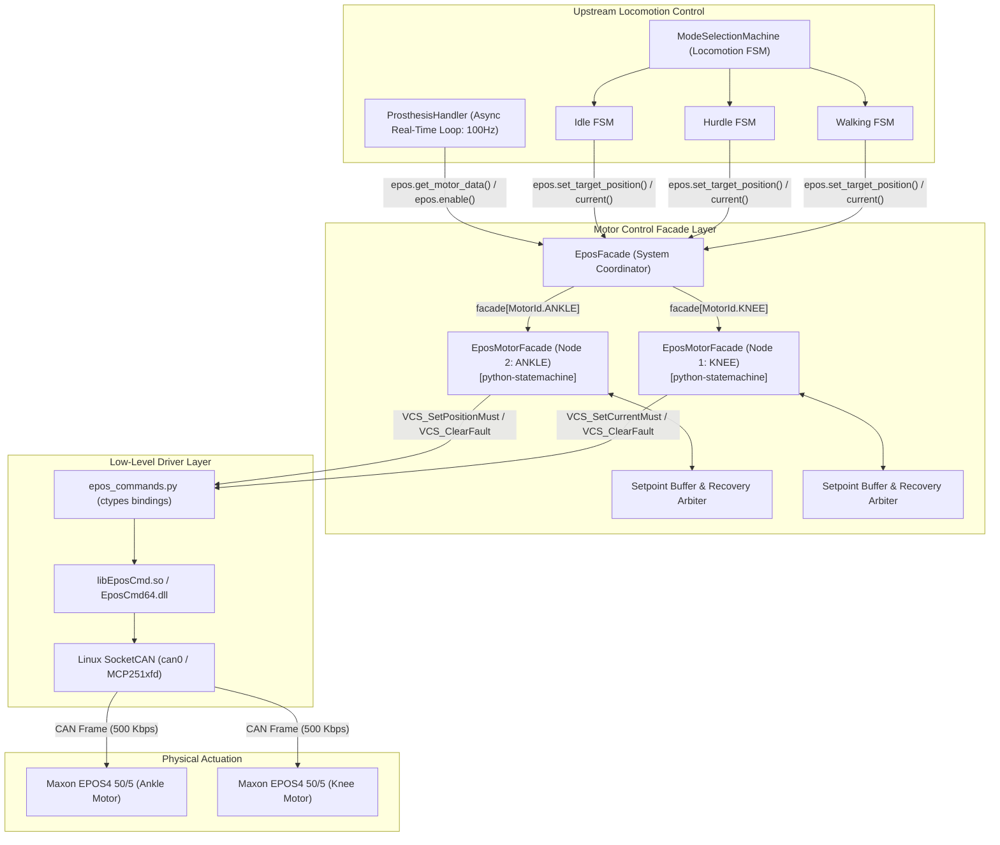
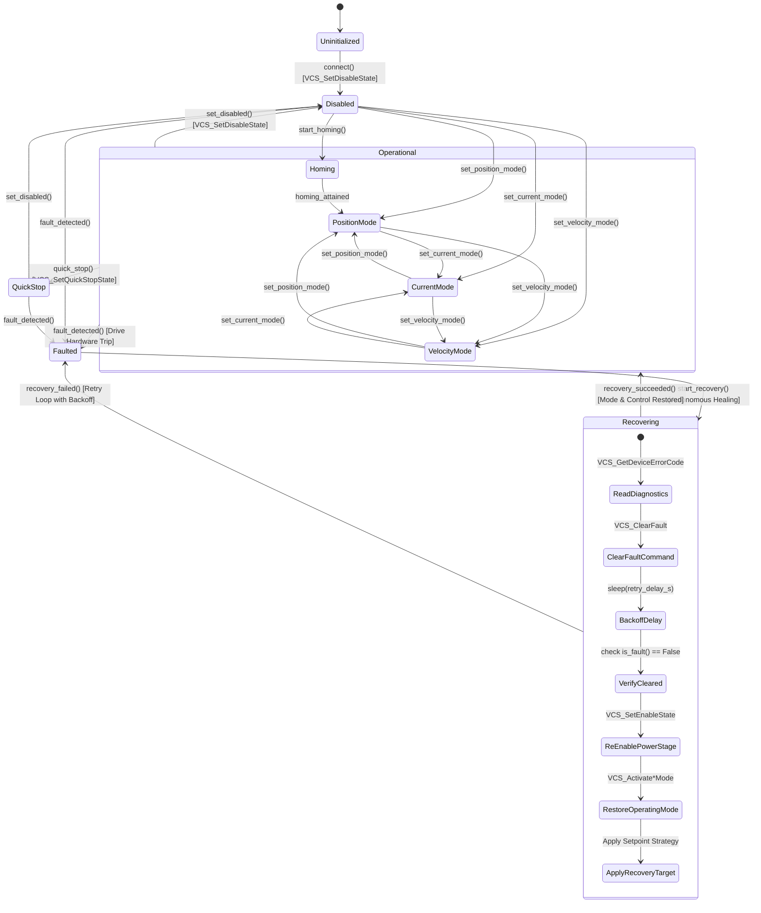
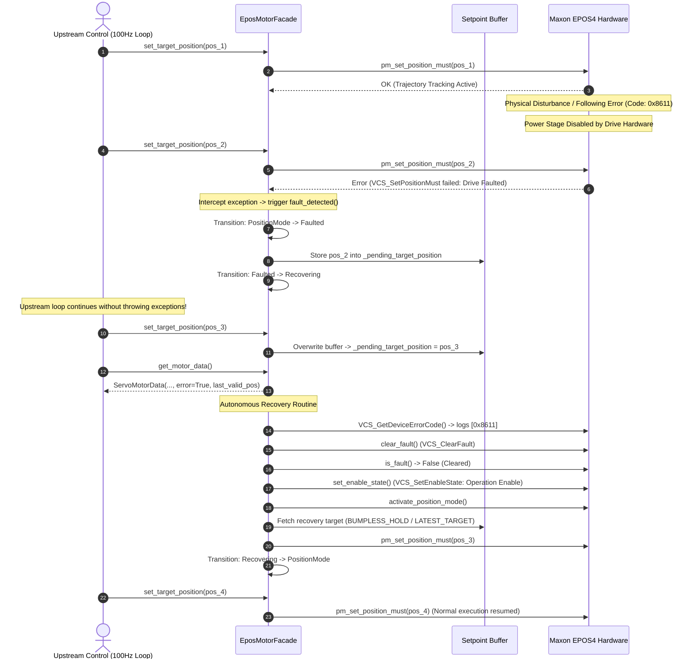

# EPOS Facade & Drive State Machine Architecture

## 1. Overview & Architectural Motivation

The MAXON EPOS4 motor controllers are stateful digital positioning devices operating under the **CANopen CiA 402 Device Profile for Drives and Motion Control**. 

In the AidWear active prosthetic system, high-level control loops (locomotion state machines such as `Walking`, `Hurdle`, `Idle`, and `SitToStand`) execute at a fixed cyclic rate (e.g. 100 Hz, $dt = 0.01\,\text{s}$). During dynamic locomotion, external perturbations, physical hardstops, or sudden ground impact forces can cause temporary physical motor trips (such as following error `0x8611`, current limit warning `0x2310`, or transient communication glitches).

Without a dedicated abstraction layer, any low-level fault disables the drive's power stage, causing subsequent motion commands (`pm_set_position_must`, `cm_set_current_must`) to fail with ctypes exceptions, halting the entire upstream control pipeline.

The **EPOS Facade** (`EposFacade` and `EposMotorFacade`) bridges this gap by:
1. Providing an object-oriented facade decoupling high-level ambulation logic from CANopen primitives.
2. Implementing an independent **CiA 402 drive state machine** for each physical motor using the `python-statemachine` library.
3. Automatically intercepting physical drive trips, retrieving diagnostic error codes, clearing faults, re-enabling the power stage, and restoring the desired operating mode.
4. Buffering real-time setpoints emitted while a motor is recovering, ensuring uninterrupted control execution.
5. Providing independent multi-motor operation so that if one joint (e.g. Knee) recovers, the other joint (e.g. Ankle) continues moving without disruption.

---

## 2. Component & System Architecture

---

## 3. Drive State Machine (`EposMotorFacade`)

Each physical motor runs its own instance of `EposMotorFacade` inheriting from `statemachine.StateMachine`.

---

## 4. Fault Interception, Recovery & Setpoint Buffering Sequence

The diagram below demonstrates how the Facade protects high-level gait execution when a drive trips mid-motion:

---

## 5. Architectural Decisions & Justifications

### 1. Per-Motor State Machines vs. Monolithic Controller
* **Decision**: Each motor node (`MotorId.ANKLE`, `MotorId.KNEE`) is managed by its own dedicated `EposMotorFacade(StateMachine)`. The parent `EposFacade` acts as a container and coordinator.
* **Justification**: Motors on a CANopen bus are independent physical nodes. If the Knee encounters a high-friction spike or trips a following error while flexing, the Ankle is unaffected. Coupling them into a single state machine would force both motors to halt or reset, destabilizing user balance. Per-motor state machines allow the Ankle to continue supporting weight while the Knee heals.

### 2. Setpoint Buffering vs. Throwing Exceptions
* **Decision**: Emitting setpoints (`set_target_position`, `set_target_current`, `set_target_velocity`) during `Faulted` or `Recovering` states buffers the setpoint internally and returns `False` rather than throwing an exception.
* **Justification**: Locomotion controllers generate continuous trajectory splines at 100 Hz. Crashing the thread on a temporary trip terminates the prosthesis operating system. Setpoint buffering ensures zero dropped loop iterations and applies the fresh target immediately once the drive re-arms.

### 3. Indefinite Recovery Retry Policy (`max_retries = -1`)
* **Decision**: Autonomous recovery continues retrying indefinitely with a small backoff delay (`retry_delay_s = 0.05s`) until cleared or until explicit shutdown.
* **Justification**: In wearable robotics, a permanent latched shutdown leaves the patient with a locked or limp prosthesis mid-stride. Transient faults (e.g. momentary current limit or contact bounce) clear rapidly; retrying indefinitely ensures the device automatically recovers as soon as mechanical conditions allow.

---

## 6. Critical Warnings, Side Effects & Artifact Pitfalls

> [!WARNING]
> ### Mechanical Jerk on Immediate Setpoint Re-Application (`LATEST_TARGET`)
> If the joint moved mechanically due to external gravity or patient motion while the power stage was unpowered, the actual encoder position will have drifted from the last commanded target.
> If `RecoveryStrategy.LATEST_TARGET` is used, the drive will attempt to instantaneously eliminate this delta upon re-enabling, which can cause:
> 1. A sudden, violent jerk perceptible to the user.
> 2. An instantaneous following error trip (`0x8611`), causing the motor to re-fault immediately.
>
> **Mitigation**: Use `RecoveryStrategy.BUMPLESS_HOLD` (default). This reads `get_position()` upon re-enabling and commands the current physical position as the initial setpoint, allowing the next upstream trajectory cycle to ramp smoothly.

---

> [!WARNING]
> ### Synchronous SDO Communication Latency & Real-Time Loop Jitter
> Low-level recovery commands (`VCS_ClearFault`, `VCS_SetEnableState`, `VCS_ActivatePositionMode`) execute synchronous CAN Service Data Object (SDO) requests over the CAN bus.
> Each SDO handshake takes approximately $5\text{--}15\,\text{ms}$. If recovery executes synchronously within the main 100 Hz (`dt = 0.01s`) control loop, it will introduce loop overruns (timing jitter).
>
> **Mitigation**:
> - The telemetry loop in `_poll_motor_data` runs asynchronously in an asyncio background worker.
> - If strict microsecond determinism is required in future cyclic synchronous modes (CSP / CSV), recovery execution should be delegated to an asynchronous background worker task.

---

> [!CAUTION]
> ### Thermal Trips & High-Frequency Infinite Retries
> If an unrecoverable hardware fault occurs—such as a motor thermal sensor trip (`0x4210`), an encoder disconnection (`0x7300`), or an internal power bridge failure:
> Setting `max_retries = -1` causes the recovery engine to continually attempt `clear_fault()` every `retry_delay_s` (50 ms).
> 
> **Potential Side Effects**:
> 1. Saturates the CAN bus with repeated clear fault SDO packets.
> 2. Floods console log streams with diagnostic reports.
>
> **Mitigation**: In applications requiring strict diagnostic isolation, implement an exponential backoff (e.g. 50ms $\to$ 200ms $\to$ 1s) when consecutive recovery attempts exceed a threshold.

---

> [!IMPORTANT]
> ### Stale Telemetry Retention During Fault State
> When a motor is faulted or recovering, `get_motor_data()` returns the last known valid position and velocity with `error = True` to prevent uncaught ctypes crashes in polling tasks.
>
> **Potential Side Effect**:
> Upstream state estimation filters (such as gait phase estimators, Kalman filters, or IMU-encoder complementary fusion) that integrate encoder velocity without checking `data.error` will integrate stale readings during the recovery window.
>
> **Mitigation**: Always check `if motor_sample.error:` in upstream estimators to handle or freeze filter state during drive recovery.

---

> [!TIP]
> ### Impedance Mode Switching in Mid-Level State Machines
> In modes using virtual impedance torque control (such as Knee swing in `Hurdle` or `Walking`), switching between Position Mode and Current Mode changes the control word in the drive.
> When switching from Position Mode to Current Mode, the Facade automatically enables the drive and activates current mode setpoints.
> Ensure that torque setpoints computed from stiffness $K \cdot (q_{\text{des}} - q)$ and damping $B \cdot \dot{q}$ clip currents within safe thermal limits (`current_limit_ma`) before dispatching to `set_target_current()`.
