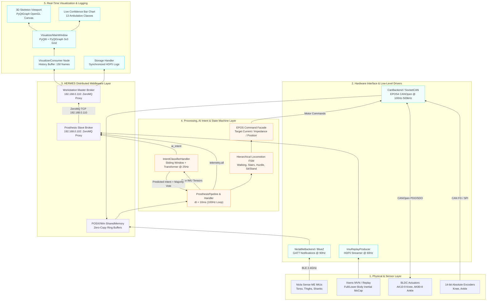
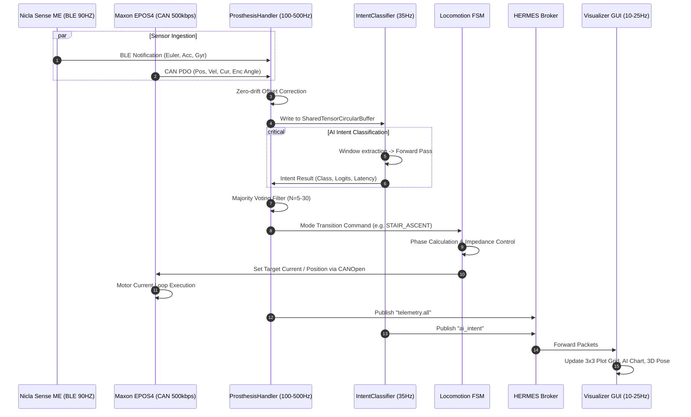
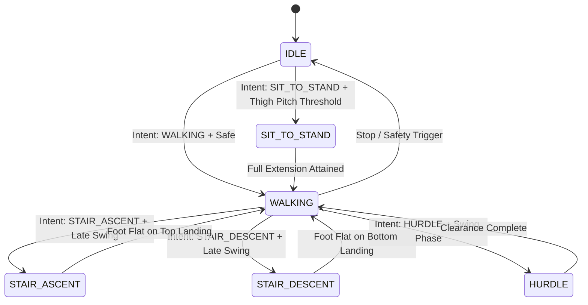

# AidWear / HERMES Prosthesis System Architecture & Data Pipeline Documentation

This document provides a comprehensive technical reference for engineers, researchers, and collaborators working on the **AidWear** smart active transfemoral / transtibial prosthesis and the underlying **HERMES** distributed robotics middleware.

---

## 1. High-Level System Architecture

The AidWear prosthesis is a cyber-physical system integrating wearable inertial sensors, motor drive telemetry, absolute joint encoders, deep-learning intent recognition, a hierarchical finite state machine (FSM), and real-time visualization.

### 1.1 Architecture Diagram



---

## 2. Distributed Network & Node Topology

The system operates across a heterogeneous distributed network consisting of:
1. **Onboard Prosthesis Computer (`192.168.0.102`)**: Typically a Raspberry Pi 4 / CM4 running Linux with real-time kernel patches, SocketCAN interface, and BlueZ Bluetooth stack.
2. **Master Workstation / Edge GPU (`192.168.0.110`)**: High-performance PC running Windows/Linux executing deep neural network inference (or model training replay), experiment coordination, and the PyQt6 GUI dashboard.

### 2.1 Master-Slave Broker Orchestration
HERMES uses a decentralized ZeroMQ broker topology (`XPUB`/`XSUB` sockets with port pairs: `PORT_FRONTEND = 5555`, `PORT_BACKEND = 5556`, `PORT_KILL = 5557`, `PORT_SYNC_HOST = 5558`):
- **Master Broker (`192.168.0.110`)**: Coordinates the experiment start barrier (`PORT_SYNC_HOST`), records global experiment start time (`log_time_s`), and emits the master termination kill signal (`TOPIC_KILL_BYTES = b"\x03"`).
- **Slave Broker (`192.168.0.102`)**: Disables its local master broker flag (`is_master_broker: False`), connects to the master via `remote_subscriber_ips: ["192.168.0.110"]` and `remote_publisher_ips: ["192.168.0.110"]`, and enables remote kill listener (`is_remote_kill: True`).

```
Master (192.168.0.110)                     Slave (192.168.0.102)
   [XPUB :5556]  <======= ZeroMQ TCP =======  [XSUB Proxy :5555]
   [XSUB :5555]  ======= ZeroMQ TCP ======>  [XPUB Proxy :5556]
   [KILL :5557]  ======= Kill Signal =====>  [Sub Killsig :5557]
   [SYNC :5558]  <===== Handshake Barrier ==> [Sync Host :5558]
```

---

## 3. End-to-End Data Lifecycle: Sensing to Processing to Actuation

The end-to-end loop runs with hard and soft real-time constraints:
- **Low-Level Actuator / State Machine Loop**: $100-500\text{ Hz}$ ($\Delta t = 2-10\text{ ms}$).
- **Sensory Sampling**: Nicla IMUs ($90\text{ Hz}$), Joint Encoders ($100\text{ Hz}$), Motors ($100\text{ Hz}$).
- **AI Forecasting Loop**: $35\text{ Hz}$ ($\Delta t = 30\text{ ms}$) with sliding windows of $2\text{ s}$.
- **Visualization Loop**: $25\text{ Hz}$ ($\Delta t = 40\text{ ms}$) with rolling buffers of $150\text{ frames}$.



---

### Stage 1: Sensing & Physical Acquisition

#### 1.1 Nicla Sense ME Wearable IMUs
- **Physical Mounting**: 5 sensor nodes mounted laterally on limbs: Torso/Pelvis (LED up), Right Thigh (lateral mid-thigh), Left Thigh (lateral mid-thigh), Right Shank (lateral distal near ankle), Left Shank (lateral distal near ankle).
- **Transport**: Bluetooth Low Energy (BLE 5.0) via `BleakClient` and BlueZ.
- **Protocol**: 9-byte header followed by active modality payloads:
  - Byte `0`: Modality Bitmask (`acc=0x01`, `gyr=0x02`, `mag=0x04`, `euler=0x08`, `quat=0x10`, `temp=0x20`, `baro=0x40`, `hum=0x80`).
  - Bytes `1-4`: Hardware timestamp (`uint32`).
  - Bytes `5-8`: Packet sequence counter (`uint32`).
  - Body: 16-bit signed integers in little-endian format.
- **Calibration Routine**:
  - At system boot, the researcher presses `'I'`.
  - The driver measures stationary Euler pitch/roll offsets over $5.0\text{ s}$ (`_calibrate_imus`).
  - Offsets are stored in `NiclaOffsetsSynchronized` (multiprocessing shared memory with lock) and dynamically subtracted from live samples:
    $$\theta_{\text{corrected}} = \theta_{\text{raw}} - \theta_{\text{offset}}$$

#### 1.2 Absolute Joint Encoders
- **Mounting**: Optical/magnetic absolute encoders on the knee joint and ankle joint axes, decoupled from motor gearheads to read true anatomical joint angles without backlash.
- **Acquisition**: CAN FD / SocketCAN bus via `CanBackend`.
- **Homing Reference**: In `_wait_for_homing_completion()`, EPOS homing method runs to establish the mechanical zero. The absolute encoder angle at the moment of homing completion is captured as `AbsoluteEncoderOffset.offset`:
  $$\text{JointAngle} = \text{Offset} - \text{RawAngle}$$

#### 1.3 Motor Drive Telemetry (EPOS4)
- **Actuators**: AK10-9 (Knee) and AK80-8 (Ankle) planetary gear actuators driven by Maxon EPOS4 CANOpen positioning controllers.
- **Commands & Queries**: Operating over CAN 2.0B / CAN FD (`CAN0`, $500\text{ kbps}$).
- **Sample Rate**: $100\text{ Hz}$ asynchronous poll thread querying position, velocity, and winding current.

---

### Stage 2: Ingestion & Inter-Process Communication (IPC)

Because Python GIL prevents deterministic low-level control when executing concurrent heavy tensor operations or OpenGL GUI rendering, the system isolates each component into separate OS processes using `multiprocessing.Process` and `hermes.utils.mp_utils.launch_handler`.

#### Data Synchronization Primitives:
1. **`NiclaSampleSynchronized`**:
   - Zero-copy IPC leveraging `multiprocessing.shared_memory.SharedMemory`.
   - Ring buffers write raw sensor bytes without serialization overhead.
2. **`SharedTensorCircularBuffer`**:
   - Fixed-length preallocated PyTorch tensor residing in shared memory (`device="cpu"` or pinned memory).
   - Head and tail pointers managed atomically via integer locks.
3. **Synchronization Events**:
   - `is_ready_event`: Set when child process completes hardware setup, releasing parent startup barrier.
   - `is_keep_data_event`: Set when broker enters running state, signaling producers to begin logging.
   - `is_stop_new_data_event`: Prevents buffer pollution during teardown.
   - `is_cleanup_event`: Graceful termination trigger.

---

### Stage 3: Feature Engineering & AI Intent Prediction

Located in [`src/hermes/aidwear/ai_intent/pipeline.py`](/src/hermes/aidwear/ai_intent/pipeline.py) and `IntentClassifierHandler`:

#### 3.1 Feature Ordering & Sensor Mapping
The model expects a strictly ordered tensor of features across sensors:
- **For 5 Nicla IMUs**:
  $$\text{Order} = [\text{Pelvis}, \text{Thigh Right}, \text{Thigh Left}, \text{Shank Right}, \text{Shank Left}]$$
- **For 17-sensor Xsens MVN**:
  $$\text{IDs} = [0, 11, 14, 12, 15] \quad (\text{Pelvis}, \text{UpperLeg R}, \text{UpperLeg L}, \text{LowerLeg R}, \text{LowerLeg L})$$
- **For 7-sensor MVN lower-body**:
  $$\text{IDs} = [0, 1, 4, 2, 5]$$

#### 3.2 Unit Conversions:
- Accelerations converted from sensor raw integers / $g$ to $\text{m/s}^2$:
  $$a_{\text{SI}} = a_{\text{raw}} \times \frac{4 \times 9.80665}{32768.0}$$
- Gyroscopes converted from sensor raw integers / $\text{dps}$ to $\text{rad/s}$ or standardized degrees/second:
  $$\omega_{\text{SI}} = \omega_{\text{raw}} \times \frac{500.0 \times \pi}{32768.0 \times 180.0}$$

#### 3.3 Synchronous (MVN) vs. Asynchronous (Nicla) Preprocessing & Resampling
Located in [`src/hermes/aidwear/ai_intent/utils/handler.py`](/src/hermes/aidwear/ai_intent/utils/handler.py#L170-L191) and [`src/hermes/aidwear/ai_intent/utils/utils.py`](/src/hermes/aidwear/ai_intent/utils/utils.py#L86-L268):

```
+-------------------------------------------------------------------------------------------------------+
|                                    IMU PREPROCESSING ARCHITECTURE                                     |
|                                                                                                       |
|  Xsens MVN (Awinda Base Station)                 5x Nicla Sense ME (BLE 5.0 Wireless)                |
|  - Hardware locked 60Hz clock                    - Dynamic 70-95Hz fluctuating sample rate           |
|  - Guaranteed periodic intervals                 - Wireless RF congestion, packet jitter, retries    |
|                     |                                                       |                         |
|                     v                                                       v                         |
|       [preprocess_sync_imu]                                      [preprocess_async_imu]               |
|  - Direct pinned shared buffer copy               - SharedTensorCircularBuffer.reserve(N, return_toa) |
|                                                   - Auto-detect Acc-Only (15 ch) vs Acc+Gyro (30 ch)  |
|                                                   - Interleaved feature column staging                |
|                                                                             |                         |
|                                                                             v                         |
|                                                                   [resample_async_imu]                |
|                                                   - Cutoff samples older than (t_now - 2.0s)          |
|                                                   - Uniform grid: torch.linspace(t_start, t_now, 120) |
|                                                   - 1D linear interpolation using per-sample toa_s    |
|                     \                                                       /                         |
|                      \                                                     /                          |
|                       v                                                   v                           |
|                      +-----------------------------------------------------+                          |
|                      |  Uniform Staged Tensor (1, 15/30, 120) on GPU/CUDA  |                          |
|                      |  -> Ready for DeepConvLSTM Forward Pass             |                          |
|                      +-----------------------------------------------------+                          |
+-------------------------------------------------------------------------------------------------------+
```

1. **Shared Memory Window Reservation**:
   - For Nicla IMUs, [`preprocess_async_imu`](/src/hermes/aidwear/ai_intent/utils/utils.py#L167-L268) queries each device's [`SharedTensorCircularBuffer`](/src/hermes/aidwear/ai_intent/utils/datastructures.py) via `buf.reserve(num_samples, return_toa=True)`.
   - This emits non-blocking memory window slices (`windows` and `toa_windows`) along with `buf.release` unlock callbacks, avoiding lock contention and eliminating intermediate buffer copies.

2. **Automatic Architecture Identification (Acc-Only vs. Acc+Gyro)**:
   - Inside `_copy_logic`, the function dynamically inspects the column dimension `num_cols` of incoming sensor buffers:
     - **Acc + Gyro Models** (`num_cols > 3`, e.g., 6 columns per sensor: 3 acceleration + 3 angular velocity):
       The pipeline automatically maps 3-axis acceleration into columns `[3*dev_id : 3*(dev_id+1)]` and 3-axis gyroscope into columns `[start_acc + 3*num_dev : end_acc + 3*num_dev]`. For 5 limbs, this structures the tensor into a 30-channel matrix where all 15 acceleration channels are grouped contiguously, followed by all 15 gyroscope channels, strictly satisfying the input format of [`DCL_AidWear_Lower_Body_5_IMU.pt`](/src/hermes/aidwear/ai_intent/utils/configs/cybathlon_dcl_acc_gyro.yml).
     - **Acc-Only Models** (`num_cols == 3`, 3 columns per sensor):
       The pipeline maps acceleration directly into columns `[3*dev_id : 3*(dev_id+1)]`, yielding a 15-channel matrix formatted for [`DCL_AidWear_Lower_Body_5_IMU_Acc_Only.pt`](/src/hermes/aidwear/ai_intent/utils/configs/cybathlon_dcl_acc.yml).

3. **Temporal Real-Time Alignment via `toa_s` Resampling**:
   - **The Problem**: The offline DeepConvLSTM neural network is trained on fixed-frequency sequences with an exact 120-sample receptive field ($2.0\text{ s}$ duration at $60\text{ Hz}$). While Xsens MVN base stations guarantee fixed sample periods (60 Hz clock locked at the receiver), wearable Nicla sensors operate over asynchronous Bluetooth Low Energy (BLE) connections. BLE transmissions experience radio frequency congestion, CSMA/CA backoffs, and variable connection-interval scheduling, causing dynamic sample rate fluctuations ($70\text{--}95\text{ Hz}$) and packet arrival jitter.
   - **The Solution**: In [`handler.py:L230-L265`](/src/hermes/aidwear/ai_intent/utils/handler.py#L230-L265), the pipeline passes `raw_imu` and `toa_s` to [`resample_async_imu`](/src/hermes/aidwear/ai_intent/utils/utils.py#L86-L165):
     1. Defines the temporal window boundaries: $t_{\text{start}} = t_{\text{now}} - 2.0\text{ s}$ and $t_{\text{end}} = t_{\text{now}}$.
     2. Generates a uniform temporal evaluation grid using PyTorch:
        $$\text{target\_t} = \text{torch.linspace}(t_{\text{start}}, t_{\text{now}}, 120)$$
     3. Masks out stale samples from the circular buffer where $t_{\text{sensor}} < t_{\text{start}}$ or $t_{\text{sensor}} > t_{\text{now}} + 0.1\text{ s}$.
     4. Performs 1D piece-wise linear interpolation across the valid sample timestamps to resample each sensor's measurements onto `target_t`.
   - **Result**: Irrespective of instantaneous wireless jitter or packet bursts, the neural network input layer is fed with a temporally continuous, uniform 120-sample window perfectly aligned with the offline model specification.

#### 3.4 Inference Execution:
- Input shape: `(1, num_channels, sequence_length)`, where `sequence_length` is 120 samples ($2\text{ s}$) and `num_channels` is 15 (Acc-only) or 30 (Acc+Gyro).
- Model Architecture: Multi-horizon DeepConvLSTM.
- Output: Logits across ambulation classes for multiple forecasting horizons (e.g. $t = 0.0\text{ s}$, $t = 0.2\text{ s}$, $t = 0.5\text{ s}$).
- Latency Benchmark: Calculated as $(t_{\text{end}} - t_{\text{start}}) \times 1000\text{ ms}$ and published alongside predictions.

#### 3.5 Majority Voting Filter:
To prevent false-positive mode switching from single-frame neural network noise:
```python
self._intent_majority_vote_buf.appendleft(prediction)
if all(x == prediction for x in self._intent_majority_vote_buf):
    # Transition allowed
```
A history buffer of $N = 5$ consecutive identical predictions is required before updating `self._next_mode`.

---

### Stage 4: Locomotion State Machine (FSM) & Hybrid Control

Located in [`src/hermes/aidwear/prosthesis/controller/prosthesis_handler.py`](src/hermes/aidwear/prosthesis/controller/prosthesis_handler.py) and `aidwear.prosthesis.state_machines`:



#### State Transition Protocol:
1. **Asynchronous Intent Staging**: `self._next_mode` stores incoming target mode without blocking the $100-500\text{ Hz}$ control loop.
2. **Phase Gating (`is_safe_to_switch`)**: Even if AI requests a mode switch, the active state machine will block the transition until biomechanically safe (e.g., waiting for non-weight-bearing swing phase rather than mid-stance to avoid patient collapse).
3. **Execution (`self._mode_fsm.step()`)**:
   - **Impedance Control**: Computes joint torque $\tau$ based on virtual stiffness $K$, damping $B$, and equilibrium angle $\theta_0$:
     $$\tau = -K(\theta - \theta_0) - B\dot{\theta}$$
   - **Current Conversion**: Converts torque to milli-amperes using motor torque constant $K_t$ and gear ratio $N_g$:
     $$I_{\text{target}} = \frac{\tau}{K_t \cdot N_g}$$

---

### Stage 5: Motor Driver Communication & Actuation Execution

- Located in [`src/hermes/aidwear/prosthesis/motor_control/epos_facade.py`](/src/hermes/aidwear/prosthesis/motor_control/epos_facade.py).
- **Communication Layer**: Direct CANOpen commands over SocketCAN.
- **Safety Features**:
  - `fault_detected()`: Traps drive trips, captures current telemetry with `error = True`, and prevents thread crashes.
  - `quick_stop(motor_id)`: Decelerates motor to zero within emergency deceleration limit ($1000\text{ rpm/s}$) upon safety pause.
  - Homing sequence (`CURRENT_THRESHOLD_NEGATIVE_SPEED`): Drives joints against mechanical stops at crawl speed ($600-900\text{ rpm}$), senses current threshold spike ($1000-2000\text{ mA}$), sets internal incremental encoder coordinates to zero, retracts to the offset position for the biomechanical zero coordinate, and sets the mid-level absolute encoder zero coordinate at the coresponding value.

---

### Stage 6: Real-Time Multimodal Visualization & Telemetry

- Located in [`src/hermes/aidwear/visualizer/utils/ui.py`](/src/hermes/aidwear/visualizer/utils/ui.py) and `VisualizerConsumer`.
- **Relay Mechanism**: `Consumer` runs in foreground thread, deserializes ZeroMQ payloads, and puts frames into `data_queue = Queue(maxsize=1000)`. If the queue is saturated, frames are dropped to prevent latency accumulation.
- **Visual Dashboard Components**:
  1. **3x3 Subplot Grid**: 5 IMUs (Torso, Thighs, Shanks), 2 Joint Encoders (Knee, Ankle), 2 Motor Kinematics (Positions, Velocities, Currents).
  2. **Active Mode Display**: Shows factual mode (`WALKING`, `IDLE`, etc.), sequence ID, and source (`CLI`, `GUI`, `AI`).
  3. **Live AI Intent Bar Chart**: Real-time confidence bars for all 13 ambulation classes with latency display.
  4. **3D Skeleton Viewport**: Real-time OpenGL 3D rendering with anatomical bone chains, ground grid, camera controls, and Pelvis root centering.

---

## 4. Data Format Prerequisites & Schema Matrix

Every packet exchanged between HERMES nodes must satisfy strict data schemas. The following matrix specifies the format requirements at each interface:

| Stream / Topic | Data Key | Python Type | NumPy Shape | Dtype | Units | Notes / Constraints |
| :--- | :--- | :--- | :--- | :--- | :--- | :--- |
| `telemetry.all` (Nicla) | `nicla_<loc>` | `dict` | - | - | - | `<loc>` $\in$ `{torso, thigh_right, thigh_left, shank_right, shank_left}` |
| | `.toa_s` | `np.ndarray` | `(N, 1)` | `float64` | seconds | Unix epoch timestamp from `get_time()` |
| | `.sequence_id` | `np.ndarray` | `(N, 1)` | `uint32` | count | Monotonically increasing hardware counter |
| | `.euler` | `np.ndarray` | `(N, 3)` | `float32` | degrees | `[pitch, roll, yaw]`, zero-referenced |
| | `.acceleration` | `np.ndarray` | `(N, 3)` | `int16` | raw LSB | Scale factor: $4g / 32768$ |
| | `.gyroscope` | `np.ndarray` | `(N, 3)` | `int16` | raw LSB | Scale factor: $500\text{ dps} / 32768$ |
| `telemetry.all` (Motor) | `motor_<joint>` | `dict` | - | - | - | `<joint>` $\in$ `{knee, ankle}` |
| | `.toa_s` | `np.ndarray` | `(N, 1)` | `float64` | seconds | Acquisition timestamp |
| | `.position` | `np.ndarray` | `(N, 1)` | `float32` | turns / deg | Actuator output position |
| | `.velocity` | `np.ndarray` | `(N, 1)` | `float32` | rpm | Actuator shaft velocity |
| | `.current` | `np.ndarray` | `(N, 1)` | `float32` | mA / A | Motor actual current |
| | `.error` | `np.ndarray` | `(N, 1)` | `uint8` | boolean | `0`: Nominal, `1`: EPOS drive fault |
| `telemetry.all` (Encoder)| `encoder_<joint>` | `dict` | - | - | - | Joint output side absolute angle |
| | `.toa_s` | `np.ndarray` | `(N, 1)` | `float64` | seconds | Timestamp |
| | `.angle` | `np.ndarray` | `(N, 1)` | `float32` | degrees | True joint angle relative to anatomical zero |
| `telemetry.all` (Mode) | `mode` | `dict` | - | - | - | Factual state machine mode |
| | `.toa_s` | `np.ndarray` | `(1, 1)` | `float64` | seconds | State transition timestamp |
| | `.mode` | `np.ndarray` | `(1, 1)` | `uint8` | ID | `0`: IDLE, `1`: WALKING, `2`: SIT_STAND, etc. |
| | `.sequence_id` | `np.ndarray` | `(1, 1)` | `uint32` | ID | Intent command sequence ID |
| | `.source` | `np.ndarray` | `(1, 1)` | `uint8` | Enum | `0`: CLI, `1`: GUI, `2`: AI |
| `ai_intent` | `intent` | `dict` | - | - | - | Neural network prediction output |
| | `.predictions` | `np.ndarray` | `(1, H, C)` | `float64` | probs [0, 1] | $H$: horizons, $C$: number of classes |
| | `.logits` | `np.ndarray` | `(1, H, C)` | `float64` | unnormalized | Pre-softmax model activations |
| | `.toa_s` | `np.ndarray` | `(1, 1)` | `float64` | seconds | Timestamp of window end |
| | `.compute_time_s`| `np.ndarray` | `(1, 1)` | `float64` | seconds | GPU/CPU model inference duration |
| `xsens_pose` | `position` | `np.ndarray` | `(N, S, 3)` | `float32` | meters | $S$: segment count (7 or 23), `[X, Y, Z]` |
| | `.toa_s` | `np.ndarray` | `(N, 1)` | `float64` | seconds | Replay / capture timestamp |

---

## 5. Configuration File Parameter Guide

System behavior is declaratively defined across YAML configurations in the `run/` directory.

### 5.1 Network & Broker Top-Level Parameters

```yaml
host_ip: "192.168.0.110"          # Local IP address where this broker binds
is_master_broker: True            # True on PC (master), False on prosthesis (slave)
remote_subscriber_ips: []         # IPs that will consume data published by this host
remote_publisher_ips:             # IPs of remote hosts publishing data to this host
  - "192.168.0.102"
is_remote_kill: False             # True if host should terminate upon receiving remote kill
remote_kill_ip: null              # IP address from which kill signals are accepted
logging_spec:
  stream_period_s: 60             # HDF5 file chunk write interval (seconds)
  stream_hdf5: True               # Enable disk logging
connections:                      # SSH remote startup configurations (master only)
  - ssh_username: "aidwear"
    ssh_host_ip: "192.168.0.102"
    platform: "Linux"
    pre_hook: "./run/prehook_prosthesis.sh" # Shell command executed before hermes-cli
    config_filepath: "./run/prosthesis_cli/prosthesis.yml"
    project_dir: "~/aidwear"
    output_dir: "./data"
```

### 5.2 Sensor & Actuator Specs (`settings` in `pipeline_specs`)

```yaml
niclas:
  buf_len: 3_000                  # Ring buffer sample capacity
  sampling_rate_hz: 90            # Target BLE transmission rate per sensor
  connection_type: "BLE"          # "BLE" or "I2C"
  is_pelvis_and_feet: False       # True for 7 IMUs, False for 5 Nicla IMUs
  device_mapping:                 # Physical MAC addresses of Nicla devices
    torso: "D8:4E:18:CC:F6:62"
    thigh_right: "4D:8B:11:D5:F2:46"
    thigh_left: "DF:CA:13:E0:E1:59"
    shank_right: "96:CD:19:11:5B:F7"
    shank_left: "D5:A0:BA:27:CA:09"
  gravity_scaling_factor: 4       # Accelerometer range (+/- 4g) -> Must match flashed firmware
  gyroscope_scaling_factor: 500   # Gyroscope range (+/- 500 dps) -> Must match flashed firmware
  is_acc: True                    # Enable accelerometer stream
  is_gyr: True                    # Enable gyroscope stream
  is_euler: True                  # Enable onboard sensor-fused Euler angles

motors:
  is_emulate_can: False           # Set True to bypass hardware and run virtual CAN bus
  epos:
    device: "EPOS4"
    protocol: "CAN_OPEN"
    interface: "CAN_mcp251xfd 0"  # Linux SocketCAN network interface name
    port: "CAN0"
    baudrate: 500_000              # 500 kbps CAN baudrate
    timeout_ms: 500
  device_mapping:
    knee:
      can_id: 1                   # CAN node ID for knee drive
      type: "AK10_9"
      homing:
        homing_method: "CURRENT_THRESHOLD_NEGATIVE_SPEED"
        acceleration: 1_000
        speed_switch: 600
        speed_index: 600
        current_threshold_ma: 2_000
        home_offset_enc_ticks: 0
        home_position_coordinate: 0
      absolute_encoder_reference: 180.0 # Anatomical zero reference angle (degrees)
    ankle:
      can_id: 2                   # CAN node ID for ankle drive
      type: "AK80_8"
      homing:
        acceleration: 1_000
        speed_switch: 900
        speed_index: 900
        current_threshold_ma: 1_000
        home_offset_enc_ticks: -130_000  # Offset from endstop to biomechanical zero (ticks)
        home_position_coordinate: 0
      absolute_encoder_reference: 90.0
```

### 5.3 AI Model & Feature Settings (`ai_intent`)

```yaml
settings:
  imu_type: "nicla"               # "nicla" or "mvn"
  device: "cuda:0"                # PyTorch compute device ("cuda:0" or "cpu")
  config_path: "./config/model.yml"
  classes:                        # Output label mapping
    Level-Ground Walking: 0
    Stair Ascent: 1
    Stair Descent: 2
    Hurdles: 3
    Sit to Stand: 4
  input_features:
    raw_imu:
      num_features: [6]           # 3 for Acc only, 6 for Acc + Gyro
      dtype: "float32"
      buf_len: 1_000
  module_params:
    majority_vote: 5              # Number of identical frames to confirm switch
    prediction_horizons: [0.0, 0.2, 0.5] # Forecasting lookahead times (seconds)
```

---

## 6. Multidisciplinary Design Decisions & Engineering Trade-Offs

### 6.1 Biomechanics & Control vs Machine Learning Latency
- **The Trade-Off**: Direct state machine switching from raw IMU by the deep learning model provides high flexibility but lacks stability guarantees and is susceptible to inference jitter (oversegmentation at $\approx 30\text{ ms}$).
- **The Decision**: **Two-Tier Hierarchical Control Architecture**.
  - **High-Level (Asynchronous, Soft Real-Time @ 35Hz)**: Neural network predicts high-level user activity intent.
  - **Mid-Level (Synchronous, Deterministic @ 100-500Hz)**: Finite State Machine manages biomechanical safety gating and continuous gait phase calculation.
  - **Low-Level (Hardware PID & Impedance @ 1-10kHz)**: EPOS4 controller regulates current/torque, position, velocity loops directly on the motor.
- **Safety Impact**: If the AI model drops frames or outputs an erroneous prediction during mid-stance, the FSM ignores the command until foot-off, preventing joint collapse.

### 6.2 Embedded Bluetooth (BLE) vs Synchronous Bus (CAN / SPI)
- **The Trade-Off**: Hardwired cables across the human body (pelvis to shank) suffer from motion artifacts, snag hazards, and physical fatigue breaks during gait trials.
- **The Decision**: BLE 5.0 for body-worn IMUs (Nicla [with custom firmware](/sensors_firmware/nicla_ble/)), CAN-FD for joint actuators ([with custom autohealing motor manager](/src/hermes/aidwear/prosthesis/motor_control/epos_facade.py)) and encoders mounted directly on the prosthesis chassis.
- **Engineering Mitigation**:
  - **Connection Stability**: Pre-hook script (`prehook_prosthesis.sh`) cycles `bluetoothctl` prior to launching the pipeline to clear stale BlueZ connection handles to avoid BLE connection issues.
  - **Timestamping at Ingestion**: In `BleakGATTCharacteristic` callbacks, arrival timestamps are recorded immediately using `toa_s = get_time()` to capture the exact arrival time before buffer queuing.
  - **Dynamic Rate Alignment (`resample_async_imu`)**: Wireless congestion causes Nicla packet intervals to fluctuate dynamically ($70\text{--}95\text{ Hz}$). The AI inference pipeline uses the per-sample `toa_s` to interpolate the last $2.0\text{ s}$ of sensor data onto a uniform 120-step grid at $60\text{ Hz}$. This decouples the neural network from real-time wireless jitter and guarantees continuous compatibility with offline trained models.

### 6.3 Shared Memory Ring Buffers vs Inter-Process Queues
- **The Trade-Off**: Standard Python `multiprocessing.Queue` serializes objects via `pickle`, introducing significant CPU overhead and garbage collection pauses when moving high-bandwidth multi-channel NumPy arrays.
- **The Decision**: Zero-copy shared memory (`multiprocessing.shared_memory.SharedMemory` via [`SharedTensorCircularBuffer`](/src/hermes/aidwear/ai_intent/utils/datastructures.py)).
- **Result**: Tensors are updated in place in RAM, shared between CPU/GPU through pinned memory; worker processes access arrays via views with microsecond synchronization latency.

---

## 7. Troubleshooting & Operational Guide

| Symptom | Probable Root Cause | Resolution |
| :--- | :--- | :--- |
| **No telemetry in visualizer** | Slave broker IP misconfigured to `127.0.0.1` | Set `host_ip: "192.168.0.102"`, `is_master_broker: False`, `remote_subscriber_ips: ["192.168.0.110"]` in `prosthesis.yml`. |
| **Nicla sensors fail to connect** | BlueZ BLE adapter stuck in stale connection state | Verify `pre_hook: "./run/prehook_prosthesis.sh"` is specified in `visualizer.yml` to cycle Bluetooth power. |
| **GUI freezes or lags** | Queue saturation or OpenGL driver bottleneck | Ensure `data_queue.put_nowait()` drops frames on full buffer; verify graphics drivers support OpenGL 2.1+. |
| **Motors do not move upon FSM switch** | EPOS in faulted state or homing timed out | Inspect terminal output for `EPOS reported Homing Error flag`; verify CAN wiring and 120$\Omega$ termination resistors. |
| **AI Intent shows "Class 0" continuously** | Sensor index mismatch between data streams | Verify input feature routing in `src/hermes/aidwear/ai_intent/pipeline.py` matches sensor channel count (e.g. `[0, 11, 14, 12, 15]` for 17-channel full-body MVN). |
